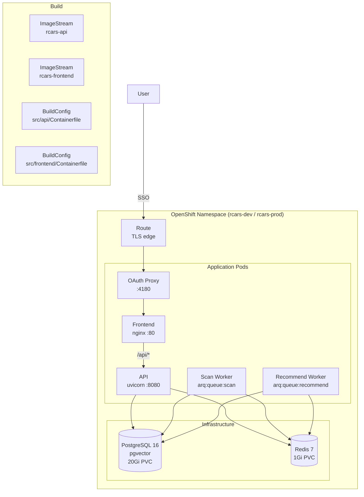

# RCARS Deployment Guide

## Architecture

RCARS runs as four application components plus infrastructure on OpenShift:

| Component | Image | Replicas | What it does |
|---|---|---|---|
| `rcars-api` | `rcars-api:latest` | 1 | FastAPI JSON API (`/api/v1/*`), health probes |
| `rcars-scan-worker` | `rcars-api:latest` (same image) | 1 | arq worker: scan, refresh, stale check, nightly maintenance |
| `rcars-recommend-worker` | `rcars-api:latest` (same image) | 1 | arq worker: advisor recommendation queries |
| `rcars-frontend` | `rcars-frontend:latest` | 1 | nginx serving React SPA |
| `rcars-oauth-proxy` | `ose-oauth-proxy` | 1 | OpenShift OAuth proxy, upstream to frontend |

Infrastructure: PostgreSQL 16 (pgvector, 20Gi PVC), Redis 7 (1Gi PVC), OAuthClient.



Two environments share the same cluster: `rcars-dev` (main branch) and `rcars-prod` (production branch). Each has its own namespace, service account, database, and secrets. Ansible vars files (`ansible/vars/dev.yml`, `ansible/vars/prod.yml`) contain secrets and are gitignored.

---

## Prerequisites

- `oc` CLI with cluster-admin access (one-time bootstrap only)
- `ansible` with `kubernetes.core` collection: `ansible-galaxy collection install -r ansible/requirements.yml`
- Read-only kubeconfig for the Babylon cluster
- Vertex AI service account JSON key
- GitHub PAT with repo read access (repo is private)

---

## Playbook Tags

| Tag | What it does | When to use |
|---|---|---|
| `mgmt-rbac` | Creates management SA, RBAC, kubeconfig | One-time per env |
| `deploy` | Full deploy: infra + app + build + migrate | First-time deploy or full update |
| `apply` | Apply namespace + app manifests only (no builds, no infra) | Config changes: user lists, env vars, resource limits |
| `build-frontend` | Build and deploy frontend only (~30s) | Frontend-only code changes |
| `build-api` | Build and deploy API + workers (~5 min) | Backend-only code changes |

---

## First-Time Setup (per environment)

### 1. Create vars file

```bash
cp ansible/vars/dev.yml.example ansible/vars/dev.yml
# or for prod:
cp ansible/vars/prod.yml.example ansible/vars/prod.yml
```

Fill in all values:

| Variable | How to get it |
|---|---|
| `pg_password` | `openssl rand -hex 16` |
| `oauth_client_secret` | `openssl rand -hex 16` |
| `oauth_cookie_secret` | `openssl rand -hex 16` |
| `cluster_domain` | `oc get ingresses.config.openshift.io cluster -o jsonpath='{.spec.domain}'` |
| `babylon_kubeconfig_path` | Path to Babylon read-only kubeconfig |
| `vertex_credentials_path` | Path to GCP Vertex AI service account JSON key |
| `vertex_project_id` | GCP project ID for Vertex AI |
| `vertex_region` | GCP region (default: `us-east5`) |
| `github_token` | GitHub PAT with repo read access |
| `curator_emails` | YAML list of curator-only emails |
| `admin_emails` | YAML list of admin emails (admins also get curator access) |

### 2. Bootstrap RBAC

Requires cluster-admin. Creates the management service account, RBAC, and a kubeconfig for future deploys.

```bash
ansible-playbook ansible/deploy.yml -e env=dev -e kubeconfig=~/.kube/config --tags mgmt-rbac
```

Verify:

```bash
KUBECONFIG=~/devel/secrets/rcars-mgmt-dev.kubeconfig oc whoami
# → system:serviceaccount:rcars-dev:rcars-mgmt-sa
```

For prod:

```bash
ansible-playbook ansible/deploy.yml -e env=prod -e kubeconfig=~/.kube/config --tags mgmt-rbac

KUBECONFIG=~/devel/secrets/rcars-mgmt-prod.kubeconfig oc whoami
# → system:serviceaccount:rcars-prod:rcars-mgmt-sa
```

### 3. Deploy

```bash
ansible-playbook ansible/deploy.yml -e env=dev --tags deploy
```

This does everything in the right order:
1. Creates namespace
2. Applies infra (Secrets, PostgreSQL, Redis, ImageStreams, BuildConfigs, OAuthClient)
3. Applies app manifests (Deployments, Services, Routes, ConfigMaps)
4. Triggers Docker builds for API (~5 min) and frontend (~30s)
5. Waits for builds to complete (image change triggers roll the pods automatically)
6. Runs database schema setup

### 4. Load initial data

After pods are running:

```bash
export KUBECONFIG=~/devel/secrets/rcars-mgmt-dev.kubeconfig

# Sync catalog from Babylon CRDs
oc exec deployment/rcars-api -n rcars-dev -- rcars refresh

# Analyze a few items to verify
oc exec deployment/rcars-api -n rcars-dev -- rcars scan --max 5
```

Once verified, run a full scan via the Admin UI or `rcars scan` (no `--max`).

### 5. Verify

Open `https://rcars-dev.apps.<cluster-domain>`. After SSO login you should see the RCARS advisor.

---

## Day-to-Day Operations

### Rebuild frontend only (~30s)

```bash
ansible-playbook ansible/deploy.yml -e env=dev --tags build-frontend
```

### Rebuild API + workers (~5 min)

```bash
ansible-playbook ansible/deploy.yml -e env=dev --tags build-api
```

### Full redeploy (infra + app + build + migrate)

```bash
ansible-playbook ansible/deploy.yml -e env=dev --tags deploy
```

### Configure scheduled maintenance

The scan worker includes a nightly maintenance pipeline (catalog refresh → stale check → re-analyze) that runs at 04:00 UTC by default. To change the schedule or disable it, update `ansible/vars/<env>.yml`:

```yaml
pipeline_enabled: true   # set to false to disable
pipeline_hour: 4         # UTC hour (0-23)
pipeline_minute: 0       # minute (0-59)
```

Then redeploy the scan worker:

```bash
ansible-playbook ansible/deploy.yml -e env=dev --tags build-api
```

### Promote to production

```bash
git checkout production && git merge main && git push && git checkout main
ansible-playbook ansible/deploy.yml -e env=prod --tags deploy
```

For targeted prod updates:

```bash
ansible-playbook ansible/deploy.yml -e env=prod --tags build-frontend
ansible-playbook ansible/deploy.yml -e env=prod --tags build-api
```

---

## Managing Users

Admin access implies curator access. Only list users in `curator_emails` if they need curator access but not admin.

Edit `ansible/vars/<env>.yml`:

```yaml
curator_emails:
  - curator-only@redhat.com

admin_emails:
  - admin-user@redhat.com
```

For ServiceAccount-based API access (e.g., from automated systems), add SA identities to the allowlist:

```yaml
sa_allowlist:
  - system:serviceaccount:my-namespace:my-sa
```

Then apply the updated manifests:

```bash
ansible-playbook ansible/deploy.yml -e env=dev --tags apply
```

This updates the deployment env vars and triggers a rollout — no image rebuilds or infrastructure changes.

---

## CLI Commands

```bash
export KUBECONFIG=~/devel/secrets/rcars-mgmt-dev.kubeconfig

# Catalog status
oc exec deployment/rcars-api -n rcars-dev -- rcars status

# Refresh catalog from Babylon
oc exec deployment/rcars-api -n rcars-dev -- rcars refresh

# Scan content (analyze Showrooms)
oc exec deployment/rcars-api -n rcars-dev -- rcars scan --max 10

# Show scan failures
oc exec deployment/rcars-api -n rcars-dev -- rcars status --failures

# Set custom content path for non-standard Showroom
oc exec deployment/rcars-api -n rcars-dev -- rcars set-content-path ci-name.prod docs/labs/
```

For prod, use `KUBECONFIG=~/devel/secrets/rcars-mgmt-prod.kubeconfig` and `-n rcars-prod`.

---

## Troubleshooting

### Check logs

```bash
oc logs deployment/rcars-api -n rcars-dev -f
oc logs deployment/rcars-scan-worker -n rcars-dev -f
oc logs deployment/rcars-recommend-worker -n rcars-dev -f
oc logs deployment/rcars-frontend -n rcars-dev -f
oc logs deployment/rcars-oauth-proxy -n rcars-dev -f
```

### Build fails

```bash
oc logs bc/rcars-api-build -n rcars-dev
oc logs bc/rcars-frontend-build -n rcars-dev
```

### Pod won't start

```bash
oc describe pod -l app=rcars,component=api -n rcars-dev
oc get events -n rcars-dev --sort-by='.lastTimestamp' | tail -20
```

### Common issues

- **Pod stuck in ContainerCreating** — usually a missing Secret (check `oc describe pod`)
- **Redis connection refused** — verify Redis pod is running
- **No Anthropic client** — verify Vertex AI credentials are mounted
- **Advisor queries stuck** — check recommend worker is running
- **OAuth redirect loop** — verify OAuthClient name matches env (`rcars-dev` or `rcars-prod`)
