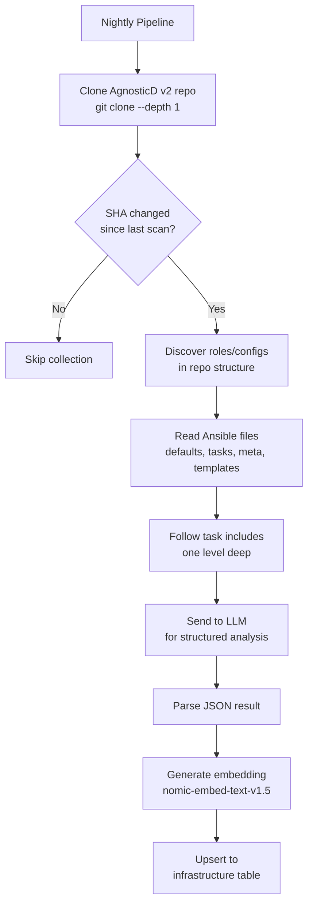

# Infrastructure Catalog

The infrastructure catalog gives RCARS visibility into what automation exists across the AgnosticD v2 repositories — every Ansible role that installs a product and every base config that provisions an environment. For each entry, an LLM reads the Ansible code and produces a structured description (what it installs, what products and capabilities it provides, what it requires). A vector embedding makes each entry semantically searchable, so a question like "What workload deploys OpenShift AI?" returns the right role even if the query doesn't match any keywords in the role name.

This is the complement to the [scan pipeline](scan-pipeline.md), which analyzes lab *content*. The infrastructure catalog analyzes the *automation* that builds and configures the environments those labs run on.

## Two Types of Infrastructure

The catalog tracks two types of entries:

| Type | What it is | Example |
|---|---|---|
| **Workload** | An Ansible role that installs a product or service on an existing cluster or system | `ocp4_workload_openshift_ai` installs OpenShift AI with model serving and notebooks |
| **Config** | A base environment configuration that provisions infrastructure from scratch | `ocp4-cluster` provisions a full OpenShift cluster on AWS |

The distinction matters because they answer different questions. "What installs OpenShift AI?" is a workload question. "What provisions a RHEL VM?" is a config question. The Advisor chat handles both and can surface results from each type when a query is ambiguous.

## How Scanning Works

The infrastructure scan runs as part of the nightly maintenance pipeline (Step 4, after catalog refresh, stale check, and re-analysis). It can also be triggered manually via `rcars infra scan`.



### What Gets Read

For **workload roles**, the scanner reads:

- `defaults/main.yml` — default variables (reveals products, versions, configuration options)
- `tasks/main.yml` — main task file (reveals what operators and resources are created)
- `meta/main.yml` — role metadata and dependencies
- Up to 5 template files — Jinja2 templates (reveals CRDs and configuration shapes)
- One level of `include_tasks` / `import_tasks` references from the main tasks file

For **base configs**, the scanner reads:

- `default_vars.yml` — environment-level defaults
- `software.yml` / `post_software.yml` — software installation playbooks
- Provider-specific `default_vars.yml` files in subdirectories (e.g., `ec2/default_vars.yml`)
- README files for additional context

### LLM Classification

The collected code is sent to the LLM with a prompt asking it to determine what the role installs or what the config provisions — based only on the code, not the name. The LLM returns a JSON object with:

- **product_name** — human-readable name (e.g., "OpenShift AI")
- **description** — what this entry does, including default configuration choices
- **products** — array of products/operators/services involved
- **capabilities** — array of capabilities enabled (e.g., "model-serving", "notebook-hosting")
- **category** — one of: ai_ml, cicd, security, storage, virtualization, networking, platform, etc.
- **requires** — prerequisites (e.g., "openshift 4.14+", "gpu-nodes")

### SHA-Based Deduplication

Before cloning, the scanner checks the remote HEAD SHA via `git ls-remote`. If every row in the `infrastructure` table for that collection already has the same SHA, the collection is unchanged and the scan is skipped. If any rows have a different SHA (or no SHA), the collection is re-scanned. This keeps nightly runs fast — only changed repos get re-analyzed.

### Embeddings

Each entry's structured data (role name, description, products, capabilities, category) is combined into an embedding text and passed through the same nomic-embed-text-v1.5 model used for lab content. The resulting 768-dimensional vector is stored in the `embeddings` table with `content_type = 'infrastructure'`. This is what powers semantic search in the Advisor chat.

## The Infrastructure Table

All infrastructure entries live in the `infrastructure` table with `role_name` as the primary key:

| Column | Type | Purpose |
|---|---|---|
| `role_name` | TEXT PK | Ansible role name or config directory name |
| `fqcn` | TEXT | Fully-qualified collection name (when available) |
| `collection` | TEXT | Source collection/repo name |
| `type` | TEXT | `workload` or `config` |
| `description` | TEXT | LLM-generated description |
| `products` | JSONB | Array of products this installs or provides |
| `capabilities` | JSONB | Array of capabilities enabled |
| `category` | TEXT | Classification category |
| `requires` | JSONB | Array of prerequisites |
| `source_sha` | TEXT | Git SHA at scan time (for dedup) |
| `scanned_at` | TIMESTAMPTZ | When this entry was last scanned |

## Search

There are two ways to search the infrastructure catalog:

**Text search** — The `GET /catalog/infrastructure` API endpoint supports `ILIKE` filtering across role name, description, products, and capabilities. This is what the Workloads & Automation page uses for its search box. Fast but literal — "RHOAI" won't match "OpenShift AI."

**Semantic search** — The Advisor chat uses vector embeddings. When the router classifies a message as an `infrastructure` intent, the query is embedded and compared against all infrastructure embeddings using cosine similarity. This handles synonyms, abbreviations, and natural-language queries. Ask "What installs the AI platform?" and it finds `ocp4_workload_openshift_ai` even though no keyword matches.

## Workloads & Automation Page

The Workloads & Automation page at `/browse/workloads` is a browse interface for the infrastructure catalog. It shows all scanned workload roles and base configs in a searchable, filterable list.

**Filters:**

- **Type** — workload, config, or all
- **Category** — ai_ml, security, platform, etc.
- **Collection** — which AgnosticD v2 repo the entry came from
- **Mappings** — entries linked to catalog items, orphans (no linked items), or all
- **Search** — text search across name, description, products, capabilities

Each entry shows its role name, type badge, category, description, and how many catalog items use it. Expanding an entry loads and displays the linked catalog items with their display names, CI names, and stage badges.

## Chat Integration

The Advisor chat supports an `infrastructure` intent for natural-language queries about workloads and configs.

**Type-hint extraction** — If the query contains explicit type keywords ("workload role", "base config", "config"), results are re-ranked to prioritize that type. Without a hint, results are ranked purely by embedding similarity.

**Ambiguous queries** — When the top 5 results contain both workloads and configs and no type hint was given, the response includes a secondary result card showing the top match of the other type. For example, asking "What handles OpenShift clusters?" might show a workload role as the primary result and a base config as a secondary "Also relevant" result.

**Linked items** — The infrastructure chat response includes the catalog items that use the matched entry, with links to the Browse page filtered to the appropriate stage.

## API Endpoints

All endpoints are under `/api/v1/catalog/`:

| Endpoint | Method | Description |
|---|---|---|
| `/infrastructure` | GET | List infrastructure catalog with item counts. Supports type, category, collection, search, and has_mappings filters. |
| `/infrastructure/{role_name}/items` | GET | Catalog items linked to a specific infrastructure entry. The `role_name` is the Ansible role name (for workloads) or config directory name (for configs). |
| `/infra-stats` | GET | Infrastructure catalog statistics: totals by type, category breakdown, mapping coverage. |

For semantic search ("What deploys OpenShift AI?"), use `POST /advisor/chat` — the infrastructure intent handles these queries through vector search, which is not exposed as a standalone API endpoint.

## CLI

```bash
rcars infra scan              # Scan all configured AgnosticD v2 collections
rcars infra scan --force      # Re-scan even if SHA unchanged
rcars infra list              # List all infrastructure entries
rcars infra show ROLE_NAME    # Show details for a specific entry
```
