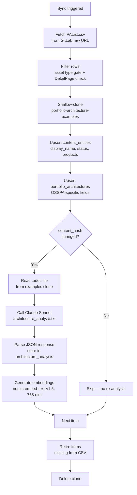

# Portfolio Architectures

The portfolio architecture pipeline extends RCARS beyond hands-on Babylon labs to include Red Hat Architecture Center assets — curated reference architectures, validated patterns, and solution patterns published via OSSPA (Open Source Solution Pattern Architecture). These assets are not provisioned environments. They are conceptual overviews that address the same products and use cases as RHDP labs but serve a different need: a sales team preparing for a customer conversation about hybrid cloud strategy does not need a running OpenShift cluster — they need a well-structured architecture diagram and an explanation of how the pieces fit together.

RCARS ingests these assets as first-class content entities using the same generalized content model as Babylon labs. Each item gets a row in `content_entities` (the universal card), a row in `portfolio_architectures` (OSSPA-specific metadata), an LLM-generated analysis in `architecture_analysis`, and vector embeddings in the shared `embeddings` table. This makes architecture items immediately searchable alongside Babylon labs via the same vector similarity engine.

The pipeline is implemented in `services/osspa_sync.py` and runs as part of the nightly maintenance schedule or on demand via `rcars osspa sync`.

---

## Source Data

Two public GitLab repositories — no authentication required:

| Repo | URL | Purpose |
|---|---|---|
| **osspa-site** | `https://gitlab.com/osspa/osspa-site` | Inventory CSV (`PAList.csv`) — what exists and its live status |
| **portfolio-architecture-examples** | `https://gitlab.com/osspa/portfolio-architecture-examples` | Content — one `.adoc` file per item |

The CSV is the authoritative inventory. It is fetched directly from the raw GitLab URL on every sync run. The examples repo is shallow-cloned once per sync to read the `.adoc` content files referenced in the CSV.

### PAList.csv — Relevant Columns

| Column | Use |
|---|---|
| `ppid` | Numeric unique ID — becomes `pa:{ppid}` as the `content_id` |
| `PAName` | URL slug (e.g. `275-rhacs-multitenant`) |
| `Heading` | Display name → `content_entities.display_name` |
| `islive` | Boolean — drives the status tag |
| `showInCatalog` | Boolean — drives the status tag |
| `Summary` | Short description — seed for `content_entities.summary` before LLM analysis |
| `Vertical` | Industry verticals → `portfolio_architectures.verticals` |
| `Solutions` | Solution areas → `portfolio_architectures.solutions` |
| `Product` | Red Hat products mentioned → `content_entities.products_json` (initial seed) |
| `ProductType` | Asset type tokens: `PA`, `VP`, `SP`, `Demo`, `IE` — drives scope filtering |
| `Image1Url` | Relative image path in the examples repo → `portfolio_architectures.image_url` |
| `DetailPage` | Relative `.adoc` path in the examples repo — required for inclusion |

---

## Ingestion Scope and Status Tagging

RCARS ingests every in-scope row with a usable `.adoc` — not just the ones currently live on the Architecture Center. This design is intentional: curators need visibility into in-progress and unpublished architectures without polluting the Advisor and Browse views that regular users see. The CSV booleans gate *visibility*, not *ingestion*.

### Ingestion Gate

A CSV row is included if and only if:

- Splitting `ProductType` on commas yields at least one token from `{PA, VP, SP}`
- None of those tokens equals `IE`
- `DetailPage` is non-empty and ends with `.adoc`

Rows excluded entirely from Phase 1:

- `ProductType=Demo` (~30 rows) — deferred; these assets may move to Interact Hub
- `ProductType=IE` (Interactive Experiences) — deferred to a future phase
- Rows with an empty `DetailPage` (e.g. `ppid=144`, which links out to redhat.com)

### Status Tag

Every ingested row is tagged with a status derived from its CSV booleans, using Babylon's existing status vocabulary so the same `WHERE status = 'prod'` filter that gates Babylon content also gates architecture content — no special cases in query code.

| CSV state | `status` | Visible by default? |
|---|---|---|
| `islive=TRUE` AND `showInCatalog=TRUE` | `prod` | Yes — Advisor + Browse |
| Exactly one of `islive` / `showInCatalog` is TRUE | `dev` | Curators only |
| Neither is TRUE | `dev` | Curators only |

As of mid-2026, approximately 39 items carry `prod` status (PA: 34, PA+VP: 3, SP: 2). The raw `is_live` and `show_in_catalog` boolean columns on `portfolio_architectures` preserve the original CSV values for curator diagnostics — so a curator can distinguish "published but not cataloged" from "neither" without re-reading the CSV.

---

## Asset Types

The `ProductType` column names asset types — kinds of Architecture Center artifacts — not Red Hat products. All three Phase 1 types map to `content_type='architecture'` and `source='portfolio_arch'` in the content model.

| Token | Full name | Description |
|---|---|---|
| `PA` | Portfolio Architecture | A curated architecture example for a solution or use case — "art of the possible", not a prescriptive standard |
| `VP` | Validated Pattern | A GitOps-deployable, tested architecture (always appears combined as `PA,VP`) |
| `SP` | Solution Pattern | A lighter-weight architectural pattern for a specific problem area |

A row carrying `PA,VP` in the `ProductType` column is ingested once, tagged with both tokens in `portfolio_architectures.asset_types`, and treated as a single architecture entity.

---

## Database Schema

Architecture items use three tables:

**`content_entities`** — the universal card, shared with Babylon items. Key fields for architecture content:

- `content_id` = `pa:{ppid}` (e.g. `pa:275`)
- `source` = `portfolio_arch`
- `content_type` = `architecture`
- `status` = `prod` or `dev`
- `display_name`, `summary`, `products_json` — populated from CSV, updated by LLM analysis

**`portfolio_architectures`** — OSSPA-specific extension table, 1:1 with `content_entities` for architecture items:

- `ppid` — original OSSPA numeric ID
- `pa_name` — URL slug from `PAName`
- `is_live`, `show_in_catalog` — raw CSV booleans, preserved for curator use
- `solutions`, `verticals` — arrays from CSV columns
- `asset_types` — raw `ProductType` tokens (e.g. `["PA", "VP"]`)
- `detail_page` — relative path to the `.adoc` file in the examples repo
- `image_url` — relative image path from `Image1Url`

**`architecture_analysis`** — LLM analysis results, following the same pattern as `showroom_analysis`. Keyed by `content_id`. Stores the structured JSON output and `content_hash` for change detection.

Vector embeddings land in the shared **`embeddings`** table with `content_type='architecture'` and `source='portfolio_arch'`, making them immediately available to the same IVFFlat cosine similarity index that serves Babylon content.

---

## Sync Pipeline



Each item is processed in sequence within a single sync run.

### Step 1 — Fetch CSV

The sync fetches `PAList.csv` from the GitLab raw URL on every run. There is no local cache — the CSV is the source of truth, and fetching it fresh ensures that status changes and new items are picked up immediately without a stale inventory.

### Step 2 — Filter Rows

The ingestion gate is applied to every CSV row. Rows that fail the gate (wrong asset type, missing `DetailPage`, IE items) are silently skipped — they are not errors, just out of scope for this phase.

### Step 3 — Clone Examples Repo

The `portfolio-architecture-examples` repo is shallow-cloned (`--depth 1`) once per sync run, before the per-item loop begins. All `.adoc` reads happen against this single clone. The clone is deleted in a `finally` block at the end of the run, regardless of whether earlier steps succeeded or failed.

### Step 4 and 5 — Upsert Content Entities and Portfolio Architectures

For every in-scope row, RCARS writes or updates the `content_entities` row first (the universal card), then the `portfolio_architectures` extension row. These upserts happen on every sync run, not just on first ingest — so changes to CSV metadata (a renamed heading, a new vertical tag) are propagated even if the `.adoc` content has not changed.

### Step 6 — Change Detection

The `.adoc` file is read and hashed. If the hash matches the `content_hash` stored from the last analysis run, the item is skipped entirely — no LLM call, no embedding regeneration. This keeps sync costs reasonable: a full run over ~70 items with no content changes costs only the CSV fetch and the hash reads, not 70 LLM calls.

### Step 7 — LLM Analysis

The `.adoc` content, along with CSV metadata (heading, summary, meta description, meta keywords), is sent to Claude Sonnet via the `prompts/architecture_analyze.txt` prompt. Temperature is 0. The prompt asks for structured JSON describing what the architecture covers and who it is for — see [LLM Analysis](#llm-analysis) below for the full output schema.

### Step 8 — Store Analysis

The parsed JSON is written to `architecture_analysis`. The `content_hash` is updated so the next sync will skip this item if the `.adoc` has not changed.

### Step 9 — Generate Embeddings

An embedding is generated from a text string that concatenates all extracted analysis fields: summary, use cases, key components, solution areas, audience, verticals, and products. Using all fields rather than just the summary gives the embedding maximum semantic coverage — an architecture about "multi-cluster OpenShift management with ACM" will match queries that use any of those terms individually.

The embedding is written to the shared `embeddings` table with `content_type='architecture'` and `source='portfolio_arch'`.

### Step 10 — Retire Stale Items

After all CSV rows have been processed, RCARS checks for `portfolio_architectures` rows whose `content_id` was not seen in the current CSV. These items receive `retired_at = NOW()` on their `content_entities` row — the same soft-delete pattern used for Babylon items. Retired architecture items are hidden from Advisor and Browse but preserved in the database with all their analysis intact.

---

## LLM Analysis

The architecture analysis prompt (`prompts/architecture_analyze.txt`) instructs Sonnet to focus on what the architecture *represents as a solution* rather than on the technical implementation details of the AsciiDoc document itself. It produces structured JSON:

```json
{
  "summary": "A multi-tenant RHACS deployment pattern for organizations managing security policy across multiple OpenShift clusters, covering centralized policy management, compliance scanning, and network segmentation.",
  "products": ["Red Hat Advanced Cluster Security", "Red Hat OpenShift Container Platform"],
  "use_cases": ["Centralized security policy management", "Multi-cluster compliance enforcement"],
  "key_components": ["RHACS Central", "Secured Cluster", "OpenShift", "Network policies"],
  "solution_areas": ["Cloud-Native Security", "Hybrid Cloud Management"],
  "audience": ["security architects", "platform engineers"],
  "verticals": ["Financial Services", "Government"]
}
```

Summary length is proportional to content depth — a sparse `.adoc` with only a diagram and a short description gets a one-sentence summary; a rich document with multiple sections gets the full two to three sentences. The prompt explicitly avoids inflating thin content.

---

## Browse Integration

Architecture items appear in the Browse catalog alongside Babylon labs. The sidebar distinguishes content types through a **Content Format** filter:

- **Hands-on Lab** — Babylon Showroom content
- **Architecture** — OSSPA portfolio architecture items

Selecting "Architecture" in the Content Format filter scopes Browse to architecture-only results. The sidebar also exposes architecture-specific filters populated from analysis and CSV data:

- **Solutions** — values from `portfolio_architectures.solutions`
- **Verticals** — values from `portfolio_architectures.verticals`
- **Audience** — values from `architecture_analysis.audience`

The workload-specific filters (Cloud Provider, AgnosticD Config, Infrastructure) are not shown when only architecture content is selected, since these concepts do not apply.

Architecture Browse cards display: display name, summary, use cases, key components, and solution areas. Curator tool filters (Failures, Unanalyzed) apply to architecture items the same way they do to labs, so curators can find architectures that failed analysis or have never been analyzed.

---

## Advisor Integration

The recommender's vector search is source-agnostic — it queries the shared `embeddings` table filtered by `status = 'prod'` and returns the closest matches regardless of whether they are labs or architectures. When an architecture item appears in the candidate set, the rationale generator formats its recommendation card differently from a lab card:

- No duration estimate (architectures are reference material, not timed exercises)
- No module breakdown
- Use cases and key components are surfaced prominently instead

This formatting difference is handled in the rationale pipeline based on `content_type`. From the Advisor's perspective, recommending an architecture to a user who asks about hybrid cloud security patterns is as valid as recommending a lab — the system surfaces both and lets the user choose what fits their context.

---

## Nightly Pipeline

The nightly maintenance pipeline at 04:00 UTC now runs two independent sub-pipelines:

**Babylon sub-pipeline** (unchanged):
catalog refresh → stale check → re-analysis → infrastructure scan → reporting sync → overlap computation

**OSSPA sub-pipeline** (new):
OSSPA sync (CSV fetch → filter → upsert → analyze changed items → retire stale)

The two sub-pipelines run sequentially within the nightly job. Either can be triggered independently from the Sync & Analysis page in the admin UI, or via the CLI.

---

## CLI

```bash
rcars osspa sync          # Fetch CSV, analyze changed items, retire stale
```

---

## Configuration

| Variable | Default | Purpose |
|---|---|---|
| `RCARS_OSSPA_MODEL` | `claude-sonnet-4-6` | Model for architecture LLM analysis |
| `RCARS_OSSPA_CLONE_DIR` | `/tmp/rcars-osspa` | Temporary directory for GitLab clones |
| `RCARS_OSSPA_GITLAB_URL` | `https://gitlab.com` | GitLab base URL |
| `RCARS_OSSPA_CSV_PATH` | `src/app/ArchitectureList/PAList.csv` | CSV path within the osspa-site repo |
