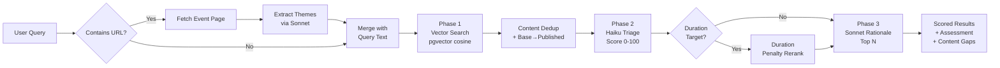

# Recommendation Engine

The recommendation engine is the core of the RCARS Advisor. When a user asks a question — "what should we show at a developer conference?" or pastes an event URL — the engine finds the best matching catalog items, scores them for relevance, and generates a structured rationale for each recommendation. It is the primary consumer of the vector embeddings and LLM analysis produced by the [scan pipeline](scan-pipeline.md).

The engine uses a three-phase progressive pipeline. Each phase narrows and enriches the results. The pipeline is implemented as a generator that yields state after each phase, allowing the web UI to show progressive results as they become available.

## Phase 1 — Vector Search

The user's query text is embedded using the same sentence-transformers model used during scanning. A pgvector cosine similarity search (`<=>` operator) finds the top candidates within a configurable distance cutoff (default: 0.55). Results beyond the cutoff are discarded — this prevents low-relevance items from reaching later phases.

**Content hash deduplication:** When multiple CIs share the same Showroom content (same `content_hash`), the vector search keeps only the best representative per unique content. Priority: prod > event > dev, published > base, lower vector distance. This prevents the same underlying lab from appearing multiple times in results under different CI names.

**Published/base CI promotion:** Embeddings are stored on base CIs (they own the Showroom content). When a base CI has a published counterpart, the vector search promotes it — presenting the published CI's identity (the orderable item) while using the base CI's analysis data. Base CIs that have a published counterpart are never shown directly.

**Ref normalization:** For deduplication fallback (when `content_hash` is not available), refs `""`, `"main"`, `"master"`, and `"HEAD"` are all treated as equivalent.

## Phase 2 — Haiku Triage

The vector search candidates are sent to Claude Haiku for fast relevance scoring. For each candidate, Haiku assigns a relevance score (0-100), a boolean relevant/not-relevant flag, and a one-line reason. Candidates below the triage cutoff (default: 30) are removed. Survivors are sorted by relevance score.

This phase is fast (~1-3 seconds) and inexpensive. It filters out items that are semantically similar but not actually relevant to the request — something embedding similarity alone cannot do.

## Duration-Aware Reranking

If the user's query mentions a duration target (e.g., "30-minute demo", "2-hour workshop"), the pipeline extracts the target duration in minutes and applies a penalty to candidates whose estimated duration diverges significantly.

- **Soft constraint** (default) — a logarithmic penalty that gently demotes mismatched durations. Coefficient 0.08, floor 0.7.
- **Hard constraint** — triggered by keywords like "hard limit", "strict", "maximum", "no more than", "at most", "cannot exceed", "must be under". Applies a steeper penalty. Coefficient 0.15, floor 0.6.

Reranking happens after triage scores are assigned and before rationale generation, so candidates are re-sorted by their adjusted scores.

## Phase 3 — Sonnet Rationale

The top candidates from triage (default: 5) are sent to Claude Sonnet with their full analysis data for structured rationale generation. For each candidate, Sonnet returns:

- **Why it fits** — topic alignment and learning outcomes
- **How to use** — practical delivery suggestion
- **Suggested format** — booth demo, hands-on lab, or presentation (based on the user's request context)
- **Duration notes** — timing adaptation suggestions
- **Caveats** — concerns or limitations relevant to the request

Sonnet also returns an overall assessment (response, top picks, adapting suggestions, content gaps) and a structured list of content gaps — topics the query asked for that no candidate addresses well. Content gaps are always surfaced in the chat response.

## Event URL Mode

When a URL is detected in the user's query, RCARS runs an event parsing step before the main pipeline:

1. **Fetch** — the landing page is fetched and links to schedule, program, tracks, talks, and similar subpages on the same domain are followed (up to 80,000 characters combined)
2. **Extract** — the page content is sent to Claude Sonnet with a structured prompt that returns an event profile: event name, dates, audience, themes, relevant technical topics, format opportunities, and 3-5 natural language search queries tailored to finding matching RHDP content
3. **Search** — the generated search queries replace (URL-only) or augment (mixed text+URL) the user's query text, then vector search proceeds as normal

**URL-only queries:** when the entire input is a URL, the search queries from the event profile are the sole input to vector search. The triage and rationale phases see these synthesized queries, not the raw URL.

**Mixed text+URL queries:** when the input contains both text and a URL (e.g., "I need booth demos for: https://example.com/conference"), the event search queries are combined with the user's text. This lets users add constraints (duration, format, audience level) on top of the event context.

**Failure handling:** if the URL cannot be fetched or Sonnet cannot extract a useful profile, and the user provided no text, the pipeline returns an error message. If the user provided text alongside the URL, the text search proceeds normally without the event context.

For broad multi-track events, follow-up queries can narrow results to specific areas (e.g., "focus on platform and infrastructure content").

## Acronym Expansion

The embedding model (`all-MiniLM-L6-v2`) does not recognize Red Hat product acronyms. "AAP" produces a poor vector match (distance 0.66) while "Ansible Automation Platform" matches well (distance 0.28).

Before embedding, RCARS expands recognized acronyms inline: "AAP" becomes "AAP (Ansible Automation Platform)". This preserves the original text while adding the expanded form for the embedding model. The expansion covers 15 Red Hat product acronyms (AAP, ACM, RHACM, ACS, RHACS, RHOAI, OCP, ARO, ROSA, RHEL, RHDH, SNO, RHSSO, EDA, TAP). The expansion is case-insensitive.
