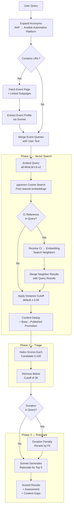

# Recommendation Engine

The recommendation engine is the core of the RCARS Advisor. When a user asks a question — "what should we show at a developer conference?" or pastes an event URL — the engine finds the best matching catalog items, scores them for relevance, and generates a structured rationale for each recommendation. It is the primary consumer of the vector embeddings and LLM analysis produced by the [scan pipeline](scan-pipeline.md).

The engine uses a three-phase progressive pipeline. Each phase narrows and enriches the results. The pipeline is implemented as a generator that yields state after each phase, allowing the web UI to show progressive results as they become available.



---

## Phase 1 — Vector Search

Vector search is how RCARS finds relevant content without requiring exact keyword matches. It works by converting the user's query into the same kind of vector embedding that was generated for each lab during the [scan pipeline](scan-pipeline.md#step-6--generate-embeddings), then finding the labs whose vectors are closest.

### How It Works

1. The user's query text is converted into a 384-dimensional vector using the same `all-MiniLM-L6-v2` model used during scanning. This vector captures the semantic meaning of the query — "I need content about securing Kubernetes clusters" produces a vector that is close to labs about ACS, compliance operators, and pod security.

2. PostgreSQL's pgvector extension compares this query vector against every stored lab embedding using **cosine distance** (the `<=>` operator). Cosine distance measures how different two vectors' directions are, on a scale from 0.0 (identical meaning) to 2.0 (opposite meaning). In practice, distances above 0.6 indicate little meaningful similarity.

3. Results are filtered by a **distance cutoff** (default: 0.55). Any lab with a cosine distance greater than 0.55 from the query is discarded — it's too far from what the user asked for to be useful. Lowering this value (e.g., 0.45) makes the search stricter and returns fewer, more tightly matched results. Raising it (e.g., 0.65) is more permissive and returns more results, including weaker matches. The default of 0.55 was tuned to balance recall (not missing relevant content) against precision (not flooding the triage phase with noise).

4. The top candidates (typically 10-15 items) are passed to Phase 2.

This entire search runs in milliseconds thanks to pgvector's IVFFlat index on the embedding column.

### Deduplication

Before passing results to triage, the vector search deduplicates to prevent the same lab content from appearing multiple times:

**Content hash deduplication:** When multiple CIs share the same Showroom content (same `content_hash`), only the best representative is kept. Priority: prod > event > dev, published > base, lower vector distance.

**Published/base CI promotion:** Embeddings are stored on base CIs (they own the Showroom content). When a base CI has a published counterpart, the vector search promotes it — presenting the published CI's identity (the orderable item) while using the base CI's analysis data.

**Ref normalization:** For deduplication fallback (when `content_hash` is not available), refs `""`, `"main"`, `"master"`, and `"HEAD"` are all treated as equivalent.

### CI Name Resolution

When a user references a specific catalog item — by lab number or by name — the vector search from the query text alone often produces poor results. Lab numbers ("LB2144") and event/delivery context ("Summit connect", "fill the AI slot") dilute the query embedding and push legitimate matches past the distance cutoff.

CI name resolution solves this by detecting references to known catalog items in the query and searching by their stored embeddings instead of the query embedding. This produces high-quality neighbors because the search starts from the referenced item's own vector — the same representation that was generated during analysis.

**Two resolution strategies run in sequence:**

1. **Lab number pattern** — regex matches `LB\d{3,4}` (case-insensitive). The number is used to find a catalog item whose `display_name` starts with that prefix (e.g., `LB2144` → "LB2144: AI AgentOps OpenShift"). Prod stage is preferred over event/dev.

2. **Keyword overlap** (only if no lab number matched) — significant words (3+ characters, excluding stop words) are extracted from the query. Catalog item display names are scanned for items with 3 or more matching words. For example, "content similar to the Experience OpenShift virtualization item" would match a display name containing "Experience", "OpenShift", and "virtualization."

When a CI is resolved, its stored `ci_summary` embedding is retrieved and used as the query vector for a neighbor search. The referenced item itself is excluded from results (the user already knows about it). Neighbor results are merged with the regular query embedding results before the distance cutoff and deduplication are applied.

**Why not widen the distance cutoff instead?** Widening the cutoff globally (e.g., from 0.55 to 0.65) would let marginal matches through for all queries, not just ones that reference specific content. The triage phase scores candidates relative to the query — if handed a list of weakly-matched items, Haiku still ranks the "best of a bad lot" and can produce plausible-looking but poor recommendations. CI name resolution is targeted: it only affects queries that reference known content and produces genuinely similar results via embedding proximity.

---

## Phase 2 — Haiku Triage

Vector search finds labs that are *semantically similar* to the query, but similarity is not the same as relevance. A lab about OpenShift networking is semantically close to a lab about OpenShift security — they share vocabulary and concepts — but if the user asked specifically for security content, the networking lab is not relevant.

The triage phase sends all vector search candidates to Claude Haiku for fast relevance scoring. Haiku receives a **compact** version of each candidate — just 8 fields:

- CI name and display name
- Summary (the 2-3 sentence overview from the scan analysis)
- Topics and products
- Category and content type
- Estimated duration

This is intentionally lightweight. Haiku does not see learning objectives, audience details, module breakdowns, or event fit assessments — that data is reserved for Phase 3 where Sonnet needs it for detailed rationale generation. The compact format is why triage is fast (1-3 seconds for 10-15 candidates) and inexpensive.

For each candidate, Haiku returns a relevance score (0-100), a relevant/not-relevant flag, and a one-line reason.

Candidates scoring below the triage cutoff (default: 30) or marked as not relevant are demoted to the "white" tier (shown but deprioritized). Survivors are promoted to the "yellow" tier and sorted by relevance score. This phase typically completes in 1-3 seconds.

### Triage Prompt

The triage prompt instructs Haiku to be **strict** — partial topic overlap is not relevance. The prompt includes:

```
You are evaluating RHDP catalog items for relevance to a user's request.

Be strict: a partial topic overlap is not relevance. If the content does
not meaningfully address what the user is asking for, mark it as not
relevant. A workshop about OpenShift is not relevant to a request for
Ansible content just because both are Red Hat products.

## Request
{the user's query}

## Candidates
--- Candidate 1 ---
CI Name: sandboxes-gpte.ocp4-wksp-ai-parasol-insurance
Display Name: Parasol Insurance AI Workshop
Summary: A hands-on workshop building an AI-powered claims processing...
Topics: LLM serving, RAG, model fine-tuning, vector databases
Products: Red Hat OpenShift AI, Red Hat OpenShift Container Platform
Category: Workshops
Content Type: workshop
Duration: 120 min
...
```

### Triage Response

```json
[
  {
    "ci_name": "sandboxes-gpte.ocp4-wksp-ai-parasol-insurance",
    "relevance_score": 92,
    "relevant": true,
    "one_line_reason": "Direct match — hands-on AI/ML workshop with RAG and model serving on OpenShift AI"
  },
  {
    "ci_name": "sandboxes-gpte.ocp4-demo-rhods-nvidia-gpu-aws",
    "relevance_score": 15,
    "relevant": false,
    "one_line_reason": "GPU infrastructure demo, not an AI application workshop"
  }
]
```

---

## Duration-Aware Reranking

If the user's query mentions a duration target (e.g., "30-minute demo", "2-hour workshop"), the pipeline extracts the target duration in minutes and applies a penalty to candidates whose estimated duration diverges significantly. Only items with **curated** duration estimates are penalized — AI-estimated durations are too unreliable to penalize against.

- **Soft constraint** (default) — a logarithmic penalty that gently demotes mismatched durations. A 2x overshoot loses ~15% of the triage score. Coefficient 0.08, floor 0.7 (score never drops below 70% of original).
- **Hard constraint** — triggered by keywords like "hard limit", "strict", "maximum", "no more than", "at most", "cannot exceed", "must be under". A 2x overshoot loses ~25%. Coefficient 0.15, floor 0.6.

Reranking happens after triage scores are assigned and before rationale generation, so candidates are re-sorted by their adjusted scores.

---

## Phase 3 — Sonnet Rationale

The top candidates from triage (default: 5) are sent to Claude Sonnet with the **full analysis data** — everything Haiku saw plus audience descriptors, stated and inferred learning objectives, module titles, and event fit assessments. This richer context lets Sonnet generate specific, actionable rationales rather than generic summaries. For each candidate, Sonnet returns:

- **Why it fits** — topic alignment and learning outcomes
- **How to use** — practical delivery suggestion
- **Suggested format** — demo or hands-on lab (based on the user's request context)
- **Duration notes** — timing adaptation suggestions
- **Caveats** — concerns or limitations relevant to the request

Sonnet also returns an overall assessment (response, top picks, adapting suggestions, content gaps) and a structured list of content gaps — topics the query asked for that no candidate addresses well. Content gaps are always surfaced in the chat response.

Candidates that receive a rationale are promoted to the "green" tier — the highest confidence level. The final result is a ranked list with three tiers: green (best fits with rationale), yellow (relevant but not in top N), and white (semantically similar but not relevant).

---

## Event URL Mode

When a URL is detected in the user's query, RCARS runs an event parsing step before the main pipeline:

1. **Fetch** — the landing page is fetched and links to schedule, program, tracks, talks, and similar subpages on the same domain are followed (up to 80,000 characters combined)
2. **Extract** — the page content is sent to Claude Sonnet with a structured prompt that returns an event profile: event name, dates, audience, themes, relevant technical topics, format opportunities, and 3-5 natural language search queries tailored to finding matching RHDP content
3. **Search** — the generated search queries replace (URL-only) or augment (mixed text+URL) the user's query text, then vector search proceeds as normal

**URL-only queries:** when the entire input is a URL, the search queries from the event profile are the sole input to vector search.

**Mixed text+URL queries:** when the input contains both text and a URL (e.g., "I need demos for: https://example.com/conference"), the event search queries are combined with the user's text. This lets users add constraints (duration, format, audience level) on top of the event context.

**Failure handling:** if the URL cannot be fetched or Sonnet cannot extract a useful profile, and the user provided no text, the pipeline returns an error message. If the user provided text alongside the URL, the text search proceeds normally without the event context.

---

## Acronym Expansion

The embedding model (`all-MiniLM-L6-v2`) does not recognize Red Hat product acronyms. "AAP" produces a poor vector match (distance 0.66) while "Ansible Automation Platform" matches well (distance 0.28).

Before embedding, RCARS expands recognized acronyms inline — "AAP" becomes "AAP (Ansible Automation Platform)". This preserves the original text while adding the expanded form for the embedding model. The expansion is case-insensitive.

Currently supported acronyms:

| Acronym | Expansion |
|---------|-----------|
| AAP | Ansible Automation Platform |
| ACM, RHACM | Advanced Cluster Management |
| ACS, RHACS | Advanced Cluster Security |
| RHOAI | Red Hat OpenShift AI |
| OCP | OpenShift Container Platform |
| ARO | Azure Red Hat OpenShift |
| ROSA | Red Hat OpenShift Service on AWS |
| RHEL | Red Hat Enterprise Linux |
| RHDH | Red Hat Developer Hub |
| SNO | Single Node OpenShift |
| RHSSO | Red Hat Single Sign-On |
| EDA | Event-Driven Ansible |
| TAP | Trusted Application Pipeline |

This is a hardcoded list in `pipeline.py` and a known limitation — acronyms not in this table will produce poor vector matches. A more robust approach (e.g., a curated dictionary loaded from the database, or automatic expansion from product metadata) is on the backlog.

---

## Configuration

| Variable | Default | Purpose |
|---|---|---|
| `RCARS_VECTOR_CUTOFF` | `0.55` | Max cosine distance for vector search (lower = stricter) |
| `RCARS_TRIAGE_MODEL` | `claude-haiku-4-5` | Model for Phase 2 triage |
| `RCARS_TRIAGE_CUTOFF` | `30` | Minimum triage score to be considered relevant |
| `RCARS_RATIONALE_MODEL` | `claude-sonnet-4-6` | Model for Phase 3 rationale |
| `RCARS_RATIONALE_TOP_N` | `5` | Number of top candidates sent to rationale phase |

## No-Match Behavior

When vector search returns zero candidates (even after CI name resolution), the pipeline returns immediately with `phase: NO_MATCHES` and a guidance message advising the user to broaden their query — focus on core topics and technologies rather than event names, lab numbers, or delivery constraints.

This is intentional: the alternative (widening the distance cutoff until something matches) produces low-quality results. Triage scores relative to the query, so handing it a list of marginally-matched items still produces plausible-looking but genuinely poor recommendations. It's better to tell the user "no close match found" than to present a bad recommendation with false confidence.

---

## API

- `POST /advisor/query` — submit a recommendation query, returns `{job_id}`
- `GET /advisor/query/{job_id}/stream` — SSE stream of progressive results
- `GET /advisor/sessions` — list user's recent sessions
- `POST /advisor/sessions/{session_id}/select` — mark a recommendation as "best fit"
