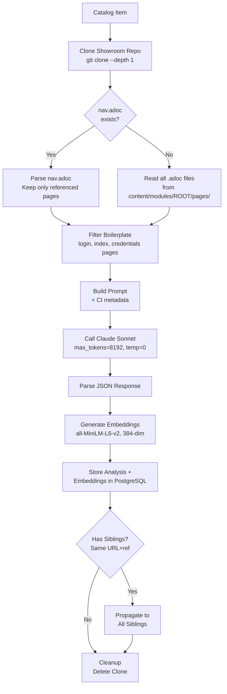

# Scan Pipeline

The scan pipeline is how RCARS understands what each lab teaches. For every catalog item that has a Showroom (a Git repository containing the lab's AsciiDoc content), the pipeline clones the repo, reads the content files, sends them to an LLM for structured analysis, generates vector embeddings from the analysis, and stores everything in PostgreSQL. The result is a searchable understanding of each lab — its topics, learning objectives, audience, duration, and format suitability — that powers both the recommendation engine and content overlap detection.

The pipeline runs on the scan worker and is implemented in `analyzer.py`. It can be triggered per-item, in bulk for unanalyzed content, or automatically as part of the nightly maintenance pipeline when stale content is detected.



Each item is processed independently with no shared state between items.

## Step 1 — Clone

The item's Showroom Git repository is shallow-cloned (`--depth 1`) to a temporary directory. If the configured branch or ref is not found, the clone falls back to the repository's default branch. Clone timeout is 120 seconds. On any clone failure, the item is marked as an error in the action log and the pipeline moves to the next item.

## Step 2 — Read

AsciiDoc files are read from the standard Antora content layout: `content/modules/ROOT/pages/*.adoc`. If a `nav.adoc` navigation file exists, RCARS parses it to identify which pages are actively linked — only pages referenced in `nav.adoc` xref lines are included. This prevents reading orphaned or draft pages that are present in the repo but not part of the live content. A custom content path can be set via the `content_path` field to handle non-standard repository layouts. Files are read with error-replacement for encoding issues. The repository HEAD commit SHA and timestamp are recorded for staleness tracking.

## Step 3 — Filter Boilerplate

Not all pages in a Showroom contain educational content. Login/credentials pages, environment setup pages, index and navigation pages, and author bio pages are filtered out before the content reaches the LLM. The filter checks both filename patterns (e.g., `index.adoc`) and content signals in the first 500 characters of each file (e.g., "your username is", "your lab environment has been provisioned"). If the filter removes everything, the pipeline falls back to the unfiltered content rather than failing.

This filtering step is important for analysis quality. Without it, the LLM would spend a significant portion of its context window on content that looks similar across every Showroom in the catalog and teaches it nothing about what makes this particular lab unique.

## Step 4 — Build Prompt and Call Sonnet

The filtered file contents are concatenated with file-level headers and truncated to a maximum of 150,000 characters. This text, along with the catalog item's metadata (CI name, display name, category, product), is inserted into the analysis prompt template (`prompts/analyze_showroom.txt`).

The prompt instructs the model to focus on what someone would **learn or experience** by completing the lab. It explicitly tells the model to skip boilerplate pages (login, credentials, environment setup) even if they slipped through the file-level filter. The prompt asks for structured JSON covering:

- **Content type** — `workshop` or `demo`
- **Summary** — 2-3 sentence description of what the lab covers and who it's for
- **Products** — Red Hat product names covered (official names)
- **Audience** — target audience descriptors (e.g., "platform engineers", "developers")
- **Difficulty** — `beginner`, `intermediate`, or `advanced` based on prerequisite knowledge
- **Estimated duration** — realistic completion time in minutes
- **Topics** — specific technical topics (e.g., "Kubernetes operators", "CI/CD pipelines")
- **Learning objectives** — split into two categories:
    - **Stated**: objectives the Showroom explicitly claims
    - **Inferred**: objectives determined from the actual exercises (e.g., a lab that deploys with ArgoCD teaches "GitOps workflows" even if never stated)
- **Modules** — per-module breakdown with title, topics, learning objectives, and duration estimate
- **Use cases** — business problems this content helps solve
- **Event fit** — suitability assessment for two formats: `demo` and `hands_on_lab`, each with a boolean and notes explaining why

Temperature is set to 0. Each analysis call is completely stateless — no conversation history is maintained between items, and the model has no knowledge of other items in the catalog.

### Example Output

A typical analysis response (abbreviated) looks like:

```json
{
  "content_type": "workshop",
  "summary": "A hands-on workshop that guides platform engineers through deploying and configuring Red Hat OpenShift AI on an existing OpenShift cluster, including model serving, data science pipelines, and GPU workload management.",
  "products": ["Red Hat OpenShift AI", "Red Hat OpenShift Container Platform"],
  "audience": ["platform engineers", "ML engineers", "data scientists"],
  "difficulty": "intermediate",
  "estimated_duration_min": 120,
  "topics": ["model serving", "data science pipelines", "GPU scheduling", "S3 storage integration"],
  "learning_objectives": {
    "stated": ["Deploy and configure OpenShift AI components", "Create and manage data science projects"],
    "inferred": ["Kubernetes resource management for ML workloads", "Object storage integration patterns"]
  },
  "modules": [
    {
      "title": "Deploying OpenShift AI Operator",
      "topics": ["operator installation", "custom resource configuration"],
      "learning_objectives": ["Install and configure the RHOAI operator"],
      "estimated_duration_min": 20
    }
  ],
  "use_cases": ["AI/ML platform enablement", "self-service data science environments"],
  "event_fit": {
    "demo": {"suitable": true, "notes": "First two modules work well as a 30-min demo of RHOAI capabilities"},
    "hands_on_lab": {"suitable": true, "notes": "Full workshop designed for 2-hour hands-on session"}
  }
}
```

This structured output drives everything downstream: the summary and learning objectives feed into vector embeddings for semantic search, the module breakdown enables the recommendation engine to suggest partial lab usage, and the duration estimate informs duration-aware reranking.

## Step 5 — Parse Response

Sonnet's response is expected to be JSON. The parser handles common response artifacts: markdown code fences (`` ```json ``), leading/trailing whitespace, and partial JSON embedded in a longer response. If parsing fails entirely, the item is marked as an error.

## Step 6 — Generate Embeddings

Two types of embeddings are generated using a locally-running sentence-transformers model (`all-MiniLM-L6-v2`, 384 dimensions):

1. **CI-level embedding** — the analysis summary, all learning objectives, topics, products, audience descriptors, use cases, and **catalog keywords** concatenated into a single string and embedded. This is the primary search target.
2. **Module-level embeddings** — one embedding per module in the analysis, built from the module title, topics, and learning objectives. These are stored but not used in the default similarity search (reserved for future module-level matching).

Catalog keywords (from `catalog_items.keywords`, sourced from the CRD's `spec.keywords` during catalog refresh) are appended to the CI-level embedding text. This is important because keywords contain metadata not present in the Showroom content itself — event tags like `rh1-2026`, product identifiers, and lab codes. Including them in the embedding means queries like "Summit 2026 labs" can match via vector similarity even when the Showroom content never mentions the event.

Keywords and analysis come from **two different sources**: keywords are read from Kubernetes CRDs during catalog refresh, while the analysis is generated by the LLM from Showroom content during scanning. The embedding is built at scan time by combining both. This means that if keywords are added or changed in the CRD after the last scan, the existing embedding will not reflect the new keywords until the item is re-scanned.

The sentence-transformers model runs locally inside the RCARS pod with no external API call. Embeddings are normalized (unit vectors), which makes cosine similarity equivalent to dot product — a requirement of pgvector's `<=>` operator.

## Step 7 — Store, Propagate, and Clean Up

The analysis and embeddings are written to the database. The temporary clone directory is deleted. This cleanup runs in a `finally` block — the clone is always deleted regardless of whether earlier steps succeeded or failed.

## Error Classification

When a scan fails, RCARS classifies the error into one of these categories (stored in `catalog_items.scan_error_class`):

| Error Class | Cause |
|---|---|
| `jinja_url` | Showroom URL contains unresolved Jinja2 template variables |
| `timeout` | Git clone or LLM call exceeded timeout |
| `private_repo` | Git repository requires authentication |
| `http_404` | Repository URL returns 404 |
| `clone_failed` | Git clone failed (network, permissions, other git error) |
| `missing_antora` | Repository does not follow standard Antora layout (`content/modules/ROOT/pages/`) |
| `no_content` | No substantive content files found after boilerplate filtering |
| `parse_error` | LLM response could not be parsed as JSON |
| `unknown` | Unclassified error |

Error classes enable targeted debugging — `jinja_url` errors indicate a catalog metadata issue, while `no_content` errors may need a custom `content_path` override.

## Git Retry Logic

Clone operations use exponential backoff with 3 retries (10s, 20s, 40s delays) when GitHub rate limiting is detected. The `git ls-remote` fast check during stale detection has a 30-second timeout.

---

## Deduplication and Propagation

Many catalog items share the same Showroom content. For example, `agd-v2.modernize-ocp-virt` exists as dev, event, and prod — if event and prod both point to the same `(showroom_url, showroom_ref)`, scanning both would be redundant.

RCARS deduplicates scan jobs by `(showroom_url, showroom_ref)`:

1. All scannable items (with Showroom URL, non-published) are grouped by `(url, ref)`.
2. One representative per group is selected for scanning (prod preferred, then event, then dev).
3. After scanning the representative, the analysis and embeddings are **propagated** to all siblings in the same group.
4. Each sibling gets its own `showroom_analysis` row and `embeddings` rows — every CI is independently searchable and recommendable.

**Different ref = different scan.** If dev has `ref=main` and prod has `ref=v1.0.0`, they are in separate groups and scanned independently, even if the underlying content happens to be identical. This avoids the complexity of resolving whether two refs point to the same commit.

**`ref=NULL` (HEAD) is its own group**, separate from `ref=main` — they may resolve to the same content, but RCARS treats them as distinct.

**No content caching.** Every scan is a fresh `git clone` with the ref resolved at clone time. There is no persistent cache of repo content between scans.

Both the CLI (`rcars scan`) and the worker (`run_analysis`) implement propagation identically.
