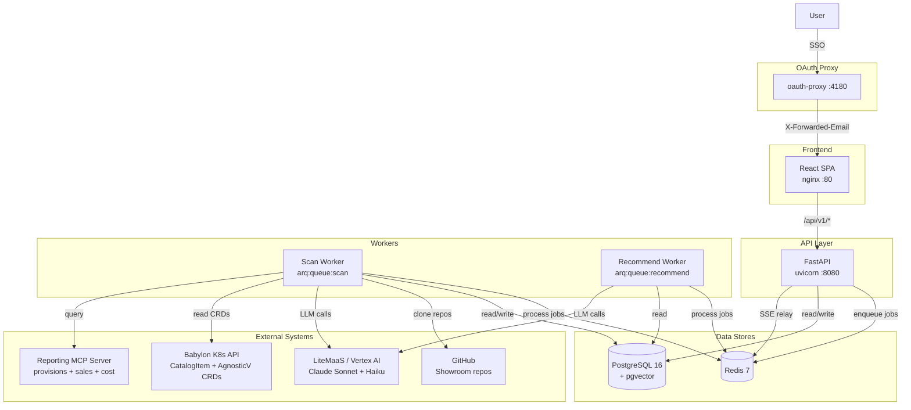

# System Design

## System Overview

RCARS is a three-tier application (React SPA, FastAPI API, arq workers) that pulls from the RHDP catalog, analyzes lab content with an LLM, stores results in PostgreSQL with pgvector, and answers recommendation queries using vector similarity search and LLM ranking.

### Deployments

| Component | Image | Queue | Purpose |
|---|---|---|---|
| `rcars-api` | `rcars-api:latest` | — | FastAPI JSON API, serves `/api/v1/*` |
| `rcars-scan-worker` | `rcars-api:latest` | `arq:queue:scan` | Analysis, catalog refresh, stale checks |
| `rcars-recommend-worker` | `rcars-api:latest` | `arq:queue:recommend` | Advisor recommendation queries |
| `rcars-frontend` | `rcars-frontend:latest` | — | React SPA (nginx), proxies `/api/*` to API |

Workers are split into two deployments so bulk scans never block user-facing advisor queries. Both workers use the same container image with different arq entrypoints.

Supporting infrastructure: PostgreSQL 16 + pgvector, Redis 7, OAuth proxy.

The main pipelines — catalog sync, content analysis, recommendation, and reporting sync — run independently and can be triggered separately.



---

## Data Sources

### Babylon Kubernetes CRDs

The RHDP catalog is defined as Kubernetes custom resources in the Babylon platform. RCARS reads two CRD types from the Babylon namespaces using a read-only kubeconfig:

- **`AgnosticVComponent`** — the primary resource for each catalog item. Contains the display name, category, product, description, keywords, stage, and workload variable configuration (which includes Showroom URLs when present).
- **`CatalogItem`** — the ordering layer resource. Used to resolve published Virtual CI identities and their relationship to underlying base components.

Three namespaces are synced:

- `babylon-catalog-prod` — live production catalog items
- `babylon-catalog-dev` — items in development or testing
- `babylon-catalog-event` — event-specific items

All three are synced on every catalog refresh. The stage (prod/dev/event) is derived from the namespace and stored on each catalog item, allowing stage-scoped queries and filtering throughout the system.

### CI Hierarchy

Catalog items in RHDP are not all the same kind of thing. There are broadly three tiers:

- **Published Virtual CIs** — ordering entry points visible on `catalog.demo.redhat.com`. Some catalog items are published this way: the Published VCI is what a user orders, and it references an underlying Base CI for the actual content and provisioning.
- **Base CIs** — the actual lab definitions, containing the Showroom content link, full description, and workload configuration. Many Base CIs are ordered directly — they don't have a Published VCI in front of them. This is actually the more common pattern.
- **Infrastructure CIs** — the underlying provisioning layer. RCARS does not interact with these.

For content analysis and recommendations, what matters is whether a CI has a Showroom URL — that is where the lab content lives and what gets analyzed by the LLM. For infrastructure-aware queries, what matters is whether the CI uses AgnosticD v2 — those items have their workload roles extracted and mapped to products regardless of whether they have Showroom content. RCARS tracks the Published VCI ↔ Base CI relationship when it exists to avoid recommending the same underlying content twice.

### RHDP Reporting Database

RCARS imports usage, sales, and cost data from the RHDP reporting database via an MCP server. This is the same data source that powers the SuperSet management dashboard. See [Retirement Analysis](retirement-analysis.md) for full details on the data import, scoring methodology, and join approach.

---

## Catalog Reader (`services/catalog.py`)

The catalog reader connects to the Babylon Kubernetes API using the configured kubeconfig and lists all `CatalogItem` and `AgnosticVComponent` resources.

For each component, it extracts:

- **Display name, category, product, description, keywords, stage** — from CatalogItem CRD metadata and labels
- **Showroom URL and ref** — extracted from the AgnosticVComponent using a two-path extraction strategy (see below)
- **Published/base CI relationship** — derived from `__meta__.components[].item` references
- **Infrastructure metadata** (AgnosticD v2 items only) — config type, cloud provider, OCP version, OS image, workload roles, ACL groups. See [Infrastructure Metadata Extraction](#infrastructure-metadata-extraction-agnosticd-v2) below.

The catalog reader is stateless. Each call to `rcars refresh` performs a full read and upsert. Items removed from Babylon are deleted from the database.

### Showroom URL Extraction

Showroom URLs are not stored in a single consistent field. RCARS uses two extraction paths, checked in priority order:

**Path 1. Top-level `spec.definition`** — the most common pattern. URL variables checked (in order): `ocp4_workload_showroom_content_git_repo`, `showroom_git_repo`, `bookbag_git_repo`. Ref variables: `ocp4_workload_showroom_content_git_repo_ref`, `ocp4_workload_showroom_content_git_ref`, `showroom_git_ref`.

*Template variable resolution:* some CIs use Jinja2 templates for the ref (e.g., `{{ showroom_repo_revision }}`). RCARS resolves these by looking up the variable name in `spec.definition`, with catalog parameter defaults taking precedence per stage.

**Path 2. Component `parameter_values`** — Zero Touch items have `deployer.type: null` and delegate to a base component, passing the showroom URL as a parameter override in `__meta__.components[].parameter_values`. This covers ~254 CIs (entire `zt-rhelbu` and most `zt-ansiblebu`).

**Template repos skipped:** URLs containing `showroom_template_default`, `showroom_template_nookbag`, or `showroom_template_zero` are filtered out — these are placeholder defaults from shared includes, not real content.

### Infrastructure Metadata Extraction (AgnosticD v2)

RCARS extracts infrastructure metadata from AgnosticD v2 component CRDs. This enables querying by infrastructure characteristics — "give me a cluster with OpenShift AI and Pipelines installed" — using faceted filters rather than vector search.

**Scope:** Only items using the canonical AgnosticD v2 deployer (`__meta__.deployer.scm_url == https://github.com/agnosticd/agnosticd-v2`).

**What's extracted:** config type (`agd_config`), cloud provider, OCP version, OS image, cluster sizing, VM topology, workloads (Ansible roles in FQCN format), and ACL groups.

**Workload extraction:** Workload role names are extracted from the CRD `spec.definition` during catalog refresh. These come from multiple sources — `workloads`, `software_workloads`, `openshift_workload_deployer_workloads`, and other stage-specific fields — and include roles from any Ansible collection, not just the `agnosticd` organization. All discovered roles are stored in `catalog_item_workloads`.

**Workload mapping:** Extracted role names are mapped to human-readable product names via a curated `workload_mapping` table. Product aliases allow queries using common names (e.g. "RHOAI", "ACS", "KubeVirt"). Only mapped workloads are surfaced in queries; unmapped roles are stored but invisible until curated.

**Workload scanner:** To help build the mapping table, RCARS scans the public agDv2 collection repos (`github.com/agnosticd/*`), reads the Ansible code (defaults, tasks, templates), and uses Haiku to determine the product name for each role. This covers the `agnosticd.*` roles but not roles from other collections — those must be mapped manually via the Admin UI. The scanner runs daily as part of the nightly pipeline, using `git ls-remote` change detection to skip unchanged repos.

**Faceted search API:** `GET /catalog/search/infrastructure` supports AND-semantics workload queries, config/cloud/OCP version/OS image filters, and automatic alias resolution.

---

## PostgreSQL Schema

RCARS uses PostgreSQL with the pgvector extension. Schema is managed with two complementary mechanisms:

- **`db.create_schema()`** — `CREATE TABLE IF NOT EXISTS` + `CREATE INDEX IF NOT EXISTS` for all tables. Handles fresh installs. Called by `rcars init-db` and on API startup.
- **Alembic** — `ALTER TABLE` migrations for schema changes to existing tables. Migration files live in `src/api/alembic/versions/`.

### Understanding Vector Embeddings

A **vector embedding** is a fixed-length list of numbers (384 in RCARS) that represents the meaning of a piece of text. Texts that mean similar things produce similar vectors, even with completely different wording. RCARS generates these for every analyzed Showroom using `all-MiniLM-L6-v2`. When a user asks a question, it is converted into the same kind of vector, and pgvector's cosine similarity search finds the closest matches.

### Tables

RCARS uses 16 tables. For full column-level details, see the [Schema Reference](schema-reference.md).

| Table | Purpose |
|---|---|
| `catalog_items` | CatalogItem CRDs from Babylon. Metadata, stage, Showroom URL, scan status, infrastructure fields |
| `showroom_analysis` | LLM analysis results — summary, modules, learning objectives, staleness tracking |
| `embeddings` | 384-dim vectors for semantic search (ci_summary + module types) |
| `enrichment_tags` | Curator-applied labels (tag_type + tag_value per CI) |
| `catalog_item_workloads` | Junction table: which workload roles each v2 CI deploys |
| `workload_mapping` | Curated mapping: workload role → product name, description, category |
| `workload_aliases` | Product name aliases for query resolution (e.g. RHOAI → OpenShift AI) |
| `catalog_item_acl_groups` | ACL groups per CI from `__meta__.access_control.allow_groups` |
| `workload_scan_state` | Last-scanned SHA per agDv2 collection repo for change detection |
| `reporting_metrics` | Usage, sales, cost data from RHDP reporting DB with retirement scores |
| `content_similarity` | Pairwise cosine similarity scores for overlap detection |
| `analysis_log` | Append-only audit trail of operations |
| `token_usage` | LLM token tracking per operation/model/provider |
| `advisor_sessions` | User queries, results, and selections (multi-turn) |
| `jobs` | Background job tracking (recommend, analyze, refresh, maintenance, workload_scan, reporting_sync) |
| `api_keys` | API key management (future, not yet active) |

### Data Model

```mermaid
erDiagram
    catalog_items ||--o| showroom_analysis : "analysis"
    catalog_items ||--o{ enrichment_tags : "tags"
    catalog_items ||--o{ embeddings : "vectors"
    catalog_items ||--o{ catalog_item_workloads : "workloads"
    catalog_items ||--o{ catalog_item_acl_groups : "acl"
    catalog_item_workloads }o--o| workload_mapping : "role mapping"
    workload_mapping ||--o{ workload_aliases : "aliases"
    
    catalog_items {
        text ci_name PK
        text display_name
        text stage
        text showroom_url
        boolean is_agd_v2
        text agd_config
        text cloud_provider
        text os_image
    }
    
    showroom_analysis {
        text ci_name PK_FK
        text summary
        jsonb modules_json
        boolean is_stale
    }
    
    catalog_item_workloads {
        serial id PK
        text ci_name FK
        text workload_fqcn
        text workload_role
    }
    
    workload_mapping {
        serial id PK
        text workload_role UK
        text product_name
        boolean verified
    }
    
    reporting_metrics {
        text catalog_base_name PK
        integer provisions
        numeric touched_amount
        numeric closed_amount
        integer retirement_score
    }

    embeddings {
        serial id PK
        text ci_name FK
        text embed_type
        vector embedding
    }
```

---

## Worker Architecture

### Why Workers Are Split

All LLM operations run in background workers, not in the API process. This keeps the API responsive — it accepts requests, creates job records, enqueues tasks to Redis, and returns immediately with a `job_id`.

Workers are split into two separate deployments:

- **`rcars-scan-worker`** — handles `run_analysis`, `run_catalog_refresh`, `run_stale_check`, `run_nightly_pipeline` (including reporting sync and workload scan). Listens on `arq:queue:scan`. These are batch operations that can run for hours.
- **`rcars-recommend-worker`** — handles `run_recommendation` only. Listens on `arq:queue:recommend`. These are user-facing queries that must respond in 30–60 seconds.

The split exists because of a starvation problem: with a single worker, a bulk scan (400+ items at ~1 minute each) would monopolize all slots for hours, making the advisor completely unresponsive.

### Job Lifecycle

1. **API** receives a request and creates a job record in PostgreSQL (`status: queued`)
2. **API** enqueues the task to the appropriate Redis queue
3. **Worker** picks up the task, updates status to `running`
4. **Worker** executes the task and writes results to PostgreSQL
5. **Worker** updates job status to `complete` or `failed`
6. For recommendation jobs: progress is published to Redis pub/sub, relayed to the browser via SSE

### Configuration

| Setting | Scan Worker | Recommend Worker |
|---|---|---|
| `max_jobs` | 5 | 3 |
| `job_timeout` | 600s | 120s |
| CPU request/limit | 500m / 2 | 250m / 1 |
| Memory request/limit | 1Gi / 4Gi | 1Gi / 2Gi |

**Special timeouts:** `run_stale_check` has a timeout of 3600s (1 hour). `run_nightly_pipeline` has 7200s (2 hours) because it chains refresh + stale check + re-analysis + workload scan + reporting sync sequentially.

### Nightly Pipeline

The scan worker runs a nightly maintenance pipeline at 04:00 UTC via arq cron:

1. **Catalog refresh** — pull latest CRDs from Babylon
2. **Stale check** — `git ls-remote` to detect changed Showroom repos
3. **Re-analysis** — rescan stale items
4. **Workload scan** — scan agDv2 collection repos for new/changed roles
5. **Reporting sync** — pull reporting data from MCP server

### LLM Provider Routing

RCARS supports two LLM providers with automatic failover:

- **LiteMaaS** (preferred) — OpenAI-compatible API hosted internally. Models are discovered at startup from `/v1/models`.
- **Vertex AI** (fallback) — Google Cloud Vertex AI with Anthropic SDK. Used when LiteMaaS is unavailable or doesn't have the requested model.

The unified `call_llm()` function routes each call to the appropriate provider. If LiteMaaS is available and has the requested model, it is used; otherwise the call falls back to Vertex AI automatically. Provider is tracked per LLM call in the `token_usage` table.

Three models are used: Sonnet for content analysis and rationale generation, Haiku for triage and workload scanning.

---

## Frontend (`src/frontend/`)

The frontend is a React SPA built with Vite and TypeScript, styled with the LCARS theme. It is served by nginx and communicates with the FastAPI backend via JSON API calls under `/api/v1/`.

### Pages

- **Advisor** — Two-pane layout: chat on the left, recommendation cards on the right. Queries are submitted via POST, progress is streamed via SSE from Redis pub/sub, and results render as scored recommendation cards grouped by tier.
- **Browse** — Filterable catalog view with collapsible filter panel (Cloud Provider, Workloads multi-select, AgnosticD Config), server-side filtering, numbered pagination. Expandable detail panels show summary, topics, products, duration, and similar content. Curator-only filter panel for unanalyzed/failures/stale items.
- **Content Analysis** — Overlap (pairwise similarity within a stage) and Retirement (scored dashboard with Prod/Without Prod tabs).
- **Admin** — Status (stat cards, scheduled maintenance, LLM provider, reporting sync), Sync & Analysis (catalog sync, content analysis, jobs), Workloads (workload scan, mapping management).

### Authentication and Roles

An OAuth proxy authenticates users against Red Hat SSO and injects `X-Forwarded-Email`. The API reads this header on every request:

- **Admin** — email in `RCARS_ADMIN_EMAILS_STR`. Full access including catalog sync, scan, and worker controls.
- **Curator** — email in `RCARS_CURATOR_EMAILS_STR`. Can trigger single-item analysis and manage enrichment tags.
- **Viewer** — authenticated but not in either list. Can use the advisor and browse.

In local development, `RCARS_DEV_USER` bypasses auth entirely. ServiceAccount tokens are validated via K8s TokenReview API against a configurable allowlist.

---

## Deployment

RCARS runs on OpenShift, managed by an Ansible playbook (`ansible/deploy.yml`) with tagged execution:

| Tag | What it does |
|---|---|
| `deploy` | Full deploy: namespace, infra + app manifests, builds, migrations, rollout wait |
| `update` | Build API + frontend, then run migrations (correct ordering for code + schema changes) |
| `build-api` | Trigger API image build, wait for build + rollout |
| `build-frontend` | Trigger frontend image build, wait for build |
| `apply` | Apply Kubernetes manifests only (config changes, secrets, env vars) |
| `migrate` | Run `rcars init-db` + `alembic upgrade head` on the current pod |
| `mgmt-rbac` | Bootstrap management ServiceAccount, ClusterRole, and kubeconfig |

**Migration ordering:** Migrations execute on the running API pod. When deploying changes that include schema modifications, use `--tags update` — never run `--tags migrate` before `--tags build-api`.

See [Deployment Guide](../admin/deployment.md) for full setup instructions.
