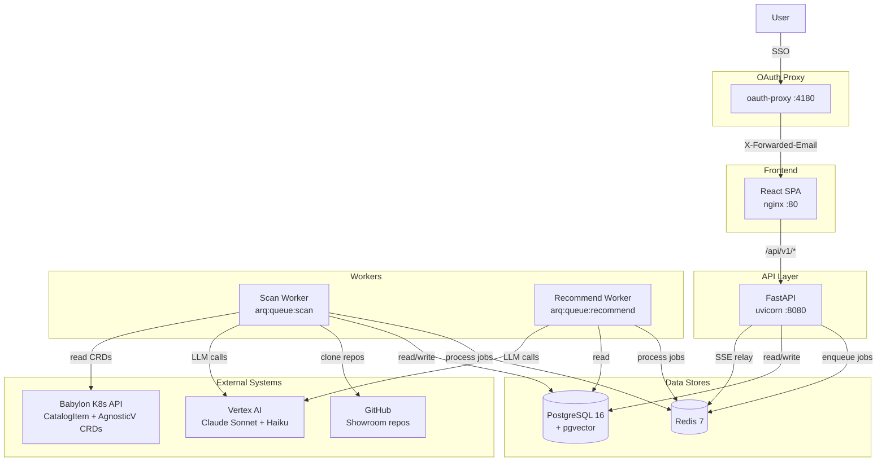
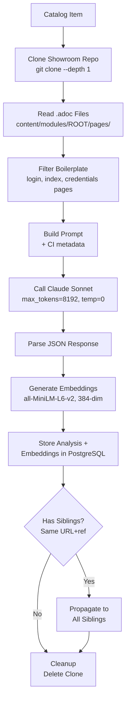
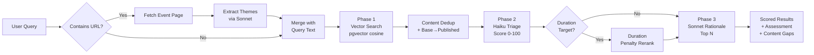
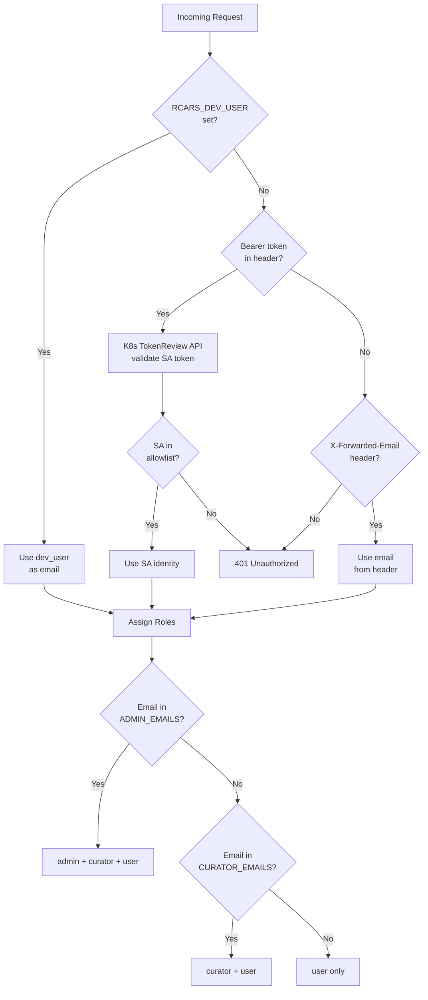

# Architecture

## System Overview

RCARS is a three-tier application (React SPA, FastAPI API, arq workers) that pulls from the RHDP catalog, analyzes lab content with an LLM, stores results in PostgreSQL with pgvector, and answers recommendation queries using vector similarity search and LLM ranking.

### Deployments

| Component | Image | Queue | Purpose |
|---|---|---|---|
| `rcars-api` | `rcars-api:latest` | — | FastAPI JSON API, serves `/api/v1/*` |
| `rcars-scan-worker` | `rcars-api:latest` | `arq:queue:scan` | Analysis, catalog refresh, stale checks |
| `rcars-recommend-worker` | `rcars-api:latest` | `arq:queue:recommend` | Advisor recommendation queries |
| `rcars-frontend` | `rcars-frontend:latest` | — | React SPA (nginx), proxies `/api/*` to API |

Workers are split into two deployments so bulk scans never block user-facing advisor queries. Both workers use the same container image with different arq entrypoints.

Supporting infrastructure: PostgreSQL 16 + pgvector, Redis 7, OAuth proxy.

The three main pipelines — catalog sync, content analysis, and recommendation — run independently and can be triggered separately. Nothing in the analysis pipeline depends on the state of an ongoing recommendation query, and vice versa.



---

## Data Sources

### Babylon Kubernetes CRDs

The RHDP catalog is defined as Kubernetes custom resources in the Babylon platform. RCARS reads two CRD types from the Babylon namespaces using a read-only kubeconfig:

- **`AgnosticVComponent`** — the primary resource for each catalog item. Contains the display name, category, product, description, keywords, stage, and workload variable configuration (which includes Showroom URLs when present).
- **`CatalogItem`** — the ordering layer resource. Used to resolve published Virtual CI identities and their relationship to underlying base components.

Three namespaces are tracked:

- `babylon-catalog-prod` — live production catalog items
- `babylon-catalog-dev` — items in development or testing
- `babylon-catalog-event` — event-specific items

By default, RCARS syncs only `babylon-catalog-prod`. The `--include-dev` flag on `rcars refresh` includes all three.

### CI Hierarchy

Catalog items in RHDP are not all the same kind of thing. There are broadly three tiers:

- **Published Virtual CIs** — ordering entry points visible on `catalog.demo.redhat.com`. Some catalog items are published this way: the Published VCI is what a user orders, and it references an underlying Base CI for the actual content and provisioning.
- **Base CIs** — the actual lab definitions, containing the Showroom content link, full description, and workload configuration. Many Base CIs are ordered directly — they don't have a Published VCI in front of them. This is actually the more common pattern.
- **Infrastructure CIs** — the underlying provisioning layer. RCARS does not interact with these.

What matters for RCARS is whether a CI has a Showroom URL — that is where the lab content lives and what gets analyzed. RCARS tracks the Published VCI ↔ Base CI relationship when it exists to avoid recommending the same underlying content twice (once as the VCI, once as the base). Where no VCI exists, the Base CI is returned directly as the recommendation target.

---

## Catalog Reader (`services/catalog.py`)

The catalog reader connects to the Babylon Kubernetes API using the configured kubeconfig and lists all `CatalogItem` and `AgnosticVComponent` resources. CatalogItems provide catalog metadata (display name, category, stage); AgnosticVComponents provide the showroom URLs from `spec.definition`.

For each component, it extracts:

- **Display name, category, product, description, keywords, stage** — from CatalogItem CRD metadata and labels
- **Showroom URL and ref** — extracted from the AgnosticVComponent using a two-path extraction strategy (see below)
- **Published/base CI relationship** — derived from `__meta__.components[].item` references

The catalog reader is stateless. Each call to `rcars refresh` performs a full read and upsert. Items removed from Babylon are deleted from the database.

### Showroom URL Extraction

Showroom URLs are not stored in a single consistent field. RCARS uses two extraction paths, checked in priority order:

**Path 1. Top-level `spec.definition`** — the most common pattern. URL variables checked (in order): `ocp4_workload_showroom_content_git_repo`, `showroom_git_repo`, `bookbag_git_repo`. Ref variables: `ocp4_workload_showroom_content_git_repo_ref`, `ocp4_workload_showroom_content_git_ref`, `showroom_git_ref`.

*Template variable resolution:* some CIs use Jinja2 templates for the ref (e.g., `{{ showroom_repo_revision }}`). RCARS resolves these by looking up the variable name in `spec.definition`, with catalog parameter defaults taking precedence per stage. Example: `modernize-ocp-virt` dev has a catalog parameter defaulting to `main`, while prod/event inherit `v1.0.0` from the definition.

**Path 2. Component `parameter_values`** — Zero Touch (ZT) Virtual CIs have `deployer.type: null` and delegate to a base component, passing the showroom URL as a parameter override in `__meta__.components[].parameter_values`. This covers ~254 CIs (entire `zt-rhelbu` and most `zt-ansiblebu`).

**Template repos skipped:** URLs containing `showroom_template_default`, `showroom_template_nookbag`, or `showroom_template_zero` are filtered out — these are placeholder defaults from shared includes, not real content.

---

## PostgreSQL Schema

RCARS uses PostgreSQL with the pgvector extension. Schema is managed with two complementary mechanisms:

- **`db.create_schema()`** — `CREATE TABLE IF NOT EXISTS` + `CREATE INDEX IF NOT EXISTS` for all tables. Handles fresh installs. Called by `rcars init-db` and on API startup.
- **Alembic** — `ALTER TABLE` migrations for schema changes to existing tables (new columns, new tables on running databases). Migration files live in `src/api/alembic/versions/`. On OpenShift, the Ansible playbook runs `rcars init-db` then `alembic upgrade head` via `k8s_exec` as the `migrate` deploy tag (`ansible-playbook ansible/deploy.yml -e env=dev --tags migrate`). Both steps are idempotent — safe to run repeatedly.

### Understanding Vector Embeddings

Several sections below reference vector embeddings. Before getting into the table structure, it helps to understand what these are and why they exist.

A **vector embedding** is a fixed-length list of numbers (in RCARS, 384 numbers) that represents the meaning of a piece of text. The numbers are produced by a machine learning model trained to place semantically similar texts close together in this 384-dimensional space. The key property: texts that mean similar things end up with similar vectors, even if they use completely different words.

For example, the phrase "hands-on OpenShift workshop for platform engineers" and the phrase "practical lab teaching Kubernetes cluster management to infrastructure teams" would produce similar vectors, because they describe the same kind of thing. A keyword search would not connect them.

RCARS generates these vectors for every analyzed Showroom using a locally-running sentence-transformers model (`all-MiniLM-L6-v2`). When a user asks a question, the question is converted into the same kind of vector, and PostgreSQL with the **pgvector** extension runs a cosine similarity search — finding stored embeddings whose vectors are closest to the query vector. This is how RCARS finds semantically relevant content without requiring exact keyword matches.

Cosine similarity measures the angle between two vectors regardless of their magnitude. A score of 1.0 means identical direction (perfect match); 0.0 means orthogonal (unrelated). pgvector's `<=>` operator returns cosine *distance* (1 minus similarity), so lower is better. An IVFFlat index on the embedding column makes this search fast even with thousands of stored vectors.

---

### `catalog_items`

One row per catalog item. The primary source of truth for everything read from the Babylon CRDs.

| Column | Type | Description |
|---|---|---|
| `ci_name` | TEXT (PK) | Unique CI identifier, e.g. `openshift-cnv.ocp4-getting-started.prod` |
| `display_name` | TEXT | Human-readable name shown in the UI and catalog |
| `category` | TEXT | Catalog category (e.g. "Workshops", "Demos") |
| `product` | TEXT | Primary Red Hat product |
| `product_family` | TEXT | Red Hat product family grouping |
| `primary_bu` | TEXT | Primary business unit |
| `secondary_bu` | TEXT | Secondary business unit |
| `stage` | TEXT | `prod`, `dev`, or `event` |
| `scope` | TEXT | Reserved scope field (exists in schema, currently unused) |
| `catalog_namespace` | TEXT | Babylon namespace this item came from |
| `keywords` | TEXT[] | Array of keyword tags |
| `description` | TEXT | Full description from the CRD |
| `icon_url` | TEXT | URL to the catalog item's icon image |
| `owners_json` | JSONB | List of owner contacts from the CRD |
| `showroom_url` | TEXT | Git repository URL for the Showroom lab content |
| `showroom_ref` | TEXT | Git branch or tag for the Showroom repo |
| `content_path` | TEXT | Custom content path override (default: `content/modules/ROOT/pages/`) |
| `last_crd_update` | TIMESTAMPTZ | Timestamp of the last CRD change in Babylon |
| `last_refreshed` | TIMESTAMPTZ | Timestamp of the last `rcars refresh` for this item |
| `is_prod` | BOOLEAN | True if stage is prod |
| `is_published` | BOOLEAN | True if this is a Published Virtual CI |
| `published_ci_name` | TEXT | For Base CIs: the Published VCI that references them (if any) |
| `base_ci_name` | TEXT | For Published VCIs: the Base CI they reference |
| `scan_status` | TEXT NOT NULL DEFAULT 'not_scanned' | Scan state: `not_scanned`, `scanned`, `error`, `no_showroom` |
| `scan_error_class` | TEXT | Error classification when `scan_status = 'error'` |
| `scan_error` | TEXT | Error message when scan failed |
| `scan_failed_at` | TIMESTAMPTZ | When the last scan failure occurred |
| `showroom_url_override` | TEXT | Curator-set override for the Showroom URL |

---

### `showroom_analysis`

One row per analyzed catalog item. Stores the full structured output from the Sonnet analysis, plus staleness tracking and curator notes.

| Column | Type | Description |
|---|---|---|
| `ci_name` | TEXT (PK, FK) | References `catalog_items.ci_name` |
| `content_type` | TEXT | `"workshop"` or `"demo"` |
| `summary` | TEXT | 2–3 sentence human-readable summary of the lab |
| `products_json` | JSONB | List of Red Hat products covered, e.g. `["OpenShift", "RHEL"]` |
| `audience_json` | JSONB | List of target audience descriptors, e.g. `["developers", "platform engineers"]` |
| `topics_json` | JSONB | Specific technical topics covered |
| `modules_json` | JSONB | Array of module objects: `[{title, topics, learning_objectives, estimated_duration_min}]` |
| `learning_objectives_json` | JSONB | `{stated: [...], inferred: [...]}` — what the lab claims vs. what it actually teaches |
| `difficulty` | TEXT | `"beginner"`, `"intermediate"`, or `"advanced"` |
| `estimated_duration_min` | INTEGER | Estimated time to complete the full lab, in minutes |
| `event_fit_json` | JSONB | Suitability assessments: `{booth_demo: {suitable, notes}, hands_on_lab: {...}, presentation_support: {...}}` |
| `use_cases_json` | JSONB | Business problems or scenarios this content addresses |
| `last_repo_commit` | TEXT | Git HEAD SHA at the time of analysis — used for staleness detection |
| `last_repo_updated` | TIMESTAMPTZ | Commit date of the HEAD at time of analysis |
| `last_analyzed` | TIMESTAMPTZ | When RCARS last ran the analysis pipeline for this item |
| `is_stale` | BOOLEAN | True if the Showroom content has changed since last analysis |
| `stale_commit` | TEXT | HEAD commit SHA at the time staleness was detected |
| `content_hash` | TEXT | SHA-256 hash of the filtered .adoc content — used for change detection |
| `enrichment_review_needed` | BOOLEAN | Curator-set flag indicating this item needs manual review |
| `notes` | TEXT | Free-text curator note — visible only to curators on the Curate page |

JSONB columns are stored as native PostgreSQL JSON and can be queried with JSON operators, though RCARS currently reads them as Python objects rather than querying inside them at the SQL level.

---

### `embeddings`

Stores vector embeddings alongside the text they were generated from. Each row represents one embedded piece of content for one catalog item.

| Column | Type | Description |
|---|---|---|
| `id` | SERIAL (PK) | Auto-incrementing row ID |
| `ci_name` | TEXT (FK) | References `catalog_items.ci_name` |
| `embed_type` | TEXT | `"ci_summary"` (item-level) or `"module"` (per-module) |
| `module_title` | TEXT | Module name — populated only for `embed_type = 'module'` |
| `content_text` | TEXT | The text that was fed to the embedding model — stored for inspection and debugging |
| `embedding` | vector(384) | The 384-dimensional vector produced by sentence-transformers |

Two embedding types are generated per analyzed item:

- **`ci_summary`** — one embedding per catalog item, built from the full analysis (summary, learning objectives, topics, products, audience, use cases) plus catalog keywords from the CRD. This is what the similarity search runs against.
- **`module`** — one embedding per lab module, built from the module title, topics, and learning objectives. Stored for potential future use in module-level matching; not used in the current default search.

The `embedding` column uses pgvector's native `vector(384)` type. An IVFFlat index on this column enables approximate nearest-neighbor search, which is significantly faster than exact search at scale and precise enough for this use case.

---

### `enrichment_tags`

Curator-applied labels attached to catalog items. Tags have a type and a value, allowing structured labeling. Tags are visible to all users on recommendation cards.

| Column | Type | Description |
|---|---|---|
| `id` | SERIAL (PK) | Auto-incrementing row ID |
| `ci_name` | TEXT (FK) | References `catalog_items.ci_name` |
| `tag_type` | TEXT | Label category, e.g. `"lifecycle"`, `"event"`, `"quality"` |
| `tag_value` | TEXT | Label value, e.g. `"retiring"`, `"kubecon-2026"`, `"flagship"` |
| `added_by` | TEXT | Email address of the curator who added the tag |
| `added_at` | TIMESTAMPTZ | When the tag was added |

A unique constraint on `(ci_name, tag_type, tag_value)` prevents duplicates. Tags are additive — multiple curators can tag the same item and all tags are retained.

---

### `analysis_log`

An append-only audit trail of every operation RCARS performs. Used by the Admin UI for scan status and by engineers debugging failed items.

| Column | Type | Description |
|---|---|---|
| `id` | SERIAL (PK) | Auto-incrementing row ID |
| `ci_name` | TEXT | The catalog item involved (not a FK — preserved even if the item is removed) |
| `action` | TEXT | `"refresh"`, `"analyze"`, or `"error"` |
| `user_id` | TEXT | Identity of who or what triggered the action (SSO email or system) |
| `details` | TEXT | Optional extra context — error messages, commit SHAs, etc. |
| `created_at` | TIMESTAMPTZ | When the action was recorded |

Nothing is deleted from this table. It grows with every `rcars refresh` and `rcars scan` run.

---

### `jobs`

Tracks background async jobs — catalog scans, recommendations, refreshes, maintenance runs. Allows the UI to show live progress and retrieve results after completion.

| Column | Type | Description |
|---|---|---|
| `id` | TEXT (PK) | Job ID string, passed to the client to poll for status |
| `job_type` | TEXT NOT NULL | Type of job: `recommend`, `analyze`, `refresh`, `scan`, `rescan`, `maintenance` |
| `status` | TEXT NOT NULL DEFAULT 'queued' | `"queued"`, `"running"`, `"complete"`, or `"failed"` |
| `queue` | TEXT NOT NULL DEFAULT 'default' | Redis queue the job was enqueued to (`scan` or `recommend`) |
| `created_by` | TEXT | SSO email of the user who triggered the job |
| `progress_json` | JSONB | Structured progress data (e.g. `{ci_name, phase, detail}`) |
| `result_json` | JSONB | Final result payload once the job completes |
| `error` | TEXT | Error message when `status = 'failed'` |
| `created_at` | TIMESTAMPTZ DEFAULT NOW() | When the job was queued |
| `started_at` | TIMESTAMPTZ | When execution began |
| `completed_at` | TIMESTAMPTZ | When the job finished (success or failure) |

---

### `token_usage`

Tracks LLM token consumption per operation type and model. Used by the Admin Token Usage page for cost monitoring and budget planning.

| Column | Type | Description |
|---|---|---|
| `id` | SERIAL (PK) | Auto-incrementing row ID |
| `operation` | TEXT NOT NULL | Operation type: `scan`, `triage`, `rationale`, `event_parse` |
| `model` | TEXT NOT NULL | LLM model used (e.g. `claude-sonnet-4-6`, `claude-haiku-4-5`) |
| `ci_name` | TEXT | Catalog item name — populated for scan operations |
| `query_text` | TEXT | Query text — populated for query operations |
| `input_tokens` | INTEGER NOT NULL DEFAULT 0 | Number of input tokens consumed |
| `output_tokens` | INTEGER NOT NULL DEFAULT 0 | Number of output tokens consumed |
| `created_at` | TIMESTAMPTZ DEFAULT NOW() | When the token usage was recorded |

---

### `advisor_sessions`

Stores advisor conversation sessions and user selections. Each session contains multiple turns (multi-turn conversation), keyed by `(session_id, turn_index)`.

| Column | Type | Description |
|---|---|---|
| `id` | SERIAL (PK) | Auto-incrementing row ID |
| `session_id` | TEXT NOT NULL | Unique session identifier (groups turns in a conversation) |
| `turn_index` | INTEGER NOT NULL | Turn number within the session (0-indexed) |
| `user_email` | TEXT | SSO email of the user who submitted the query |
| `query_text` | TEXT | The user's query text for this turn |
| `event_url` | TEXT | Event URL extracted from the query, if present |
| `results_json` | JSONB | Full recommendation results for this turn |
| `overall_assessment` | TEXT | Sonnet's overall assessment text |
| `chosen_ci_name` | TEXT | CI the user selected from recommendations |
| `chosen_at` | TIMESTAMPTZ | When the user made their selection |
| `opted_out` | BOOLEAN NOT NULL DEFAULT FALSE | True if the user dismissed without selecting |
| `created_at` | TIMESTAMPTZ DEFAULT NOW() | When this turn was recorded |

---

### `api_keys` (future, not yet active)

API key management for service-account-style programmatic access. Schema is defined but the key validation middleware is not yet wired up.

| Column | Type | Description |
|---|---|---|
| `id` | SERIAL (PK) | Auto-incrementing row ID |
| `key_hash` | TEXT NOT NULL UNIQUE | SHA-256 hash of the API key (plaintext never stored) |
| `name` | TEXT NOT NULL | Human-readable name for the key |
| `created_by` | TEXT | Email of the admin who created the key |
| `scopes` | TEXT[] | Array of allowed scopes (e.g. `["read", "advisor"]`) |
| `created_at` | TIMESTAMPTZ DEFAULT NOW() | When the key was created |
| `last_used_at` | TIMESTAMPTZ | Last time the key was used |
| `revoked_at` | TIMESTAMPTZ | When the key was revoked (NULL if active) |

---

### Data Model

```mermaid
erDiagram
    catalog_items ||--o| showroom_analysis : "ci_name FK"
    catalog_items ||--o{ enrichment_tags : "ci_name FK"
    catalog_items ||--o{ embeddings : "ci_name FK"
    
    catalog_items {
        text ci_name PK
        text display_name
        text stage
        text showroom_url
        text showroom_ref
        boolean is_published
        text published_ci_name
        text base_ci_name
        text scan_status
    }
    
    showroom_analysis {
        text ci_name PK_FK
        text summary
        jsonb modules_json
        text content_hash
        boolean is_stale
    }
    
    embeddings {
        serial id PK
        text ci_name FK
        text embed_type
        vector embedding
    }
    
    enrichment_tags {
        serial id PK
        text ci_name FK
        text tag_type
        text tag_value
    }
    
    token_usage {
        serial id PK
        text operation
        text model
        integer input_tokens
        integer output_tokens
    }
    
    advisor_sessions {
        serial id PK
        text session_id
        integer turn_index
        text user_email
        jsonb results_json
    }
    
    jobs {
        text id PK
        text job_type
        text status
        jsonb progress_json
        jsonb result_json
    }
    
    analysis_log {
        serial id PK
        text ci_name
        text action
    }
    
    api_keys {
        serial id PK
        text key_hash
        text name
        text scopes
    }
```

---

## The Scan Pipeline (`analyzer.py`)



The scan pipeline runs per catalog item and is fully isolated — each item is processed independently with no shared state or context leakage between items.

### Step 1 — Clone

The item's Showroom Git repository is shallow-cloned (`--depth 1`) to a temporary directory. If the configured branch or ref is not found, the clone falls back to the repository's default branch. Clone timeout is 120 seconds. On any clone failure, the item is marked as an error in the action log and the pipeline moves to the next item.

### Step 2 — Read

AsciiDoc files are read from the standard Antora content layout: `content/modules/ROOT/pages/*.adoc`. If a `nav.adoc` navigation file exists, RCARS parses it to identify which pages are actively linked — only pages referenced in `nav.adoc` xref lines are included. This prevents reading orphaned or draft pages that are present in the repo but not part of the live content. A custom content path can be set via the `content_path` field to handle non-standard repository layouts. Files are read with error-replacement for encoding issues. The repository HEAD commit SHA and timestamp are recorded for staleness tracking.

### Step 3 — Filter Boilerplate

Not all pages in a Showroom contain educational content. Login/credentials pages, environment setup pages, index and navigation pages, and author bio pages are filtered out before the content reaches the LLM. The filter checks both filename patterns (e.g., `index.adoc`) and content signals in the first 500 characters of each file (e.g., "your username is", "your lab environment has been provisioned"). If the filter removes everything, the pipeline falls back to the unfiltered content rather than failing.

This filtering step is important for analysis quality. Without it, the LLM would spend a significant portion of its context window on content that looks similar across every Showroom in the catalog and teaches it nothing about what makes this particular lab unique.

### Step 4 — Build Prompt and Call Sonnet

The filtered file contents are concatenated with file-level headers and truncated to a maximum of 150,000 characters. This text, along with the catalog item's metadata (CI name, display name, category, product), is inserted into the analysis prompt template.

The prompt instructs Sonnet to:

- Identify what the lab covers and who it's for
- Extract **stated** learning objectives (what the Showroom text explicitly claims)
- Infer **additional** learning objectives from the actual exercises (what a learner will genuinely learn even if it's never stated)
- Assess suitability for booth demos, hands-on sessions, and presentation support
- Return everything as structured JSON

Temperature is set to 0. Each analysis call is completely stateless — no conversation history is maintained between items, and Sonnet has no knowledge of other items in the catalog.

### Step 5 — Parse Response

Sonnet's response is expected to be JSON. The parser handles common response artifacts: markdown code fences (`\`\`\`json`), leading/trailing whitespace, and partial JSON embedded in a longer response. If parsing fails entirely, the item is marked as an error.

### Step 6 — Generate Embeddings

Two types of embeddings are generated using a locally-running sentence-transformers model (`all-MiniLM-L6-v2`, 384 dimensions):

1. **CI-level embedding** — the analysis summary, all learning objectives, topics, products, audience descriptors, use cases, and **catalog keywords** concatenated into a single string and embedded. This is the primary search target.
2. **Module-level embeddings** — one embedding per module in the analysis, built from the module title, topics, and learning objectives. These are stored but not used in the default similarity search (reserved for future module-level matching).

Catalog keywords (from `catalog_items.keywords`, sourced from the CRD's `spec.keywords` during catalog refresh) are appended to the CI-level embedding text. This is important because keywords contain metadata not present in the Showroom content itself — event tags like `rh1-2026`, product identifiers, and lab codes. Including them in the embedding means queries like "Summit 2026 labs" can match via vector similarity even when the Showroom content never mentions the event.

Keywords and analysis come from **two different sources**: keywords are read from Kubernetes CRDs during catalog refresh, while the analysis is generated by the LLM from Showroom content during scanning. The embedding is built at scan time by combining both. This means that if keywords are added or changed in the CRD after the last scan, the existing embedding will not reflect the new keywords until the item is re-scanned.

The sentence-transformers model runs locally inside the RCARS pod with no external API call. Embeddings are normalized (unit vectors), which makes cosine similarity equivalent to dot product — a requirement of pgvector's `<=>` operator.

### Step 7 — Store, Propagate, and Clean Up

The analysis and embeddings are written to the database. The temporary clone directory is deleted. This cleanup runs in a `finally` block — the clone is always deleted regardless of whether earlier steps succeeded or failed.

### Error Classification

When a scan fails, RCARS classifies the error into one of these categories (stored in `catalog_items.scan_error_class`):

| Error Class | Cause |
|---|---|
| `jinja_url` | Showroom URL contains unresolved Jinja2 template variables |
| `timeout` | Git clone or LLM call exceeded timeout |
| `private_repo` | Git repository requires authentication |
| `http_404` | Repository URL returns 404 |
| `clone_failed` | Git clone failed (network, permissions, other git error) |
| `missing_antora` | Repository does not follow standard Antora layout (`content/modules/ROOT/pages/`) |
| `no_content` | No substantive content files found after boilerplate filtering |
| `parse_error` | LLM response could not be parsed as JSON |
| `unknown` | Unclassified error |

Error classes enable targeted debugging — `jinja_url` errors indicate a catalog metadata issue, while `no_content` errors may need a custom `content_path` override.

### Git Retry Logic

Clone operations use exponential backoff with 3 retries (10s, 20s, 40s delays) when GitHub rate limiting is detected. The `git ls-remote` fast check during stale detection has a 30-second timeout.

---

## Scan Deduplication and Propagation

Many catalog items share the same Showroom content. For example, `agd-v2.modernize-ocp-virt` exists as dev, event, and prod — if event and prod both point to the same `(showroom_url, showroom_ref)`, scanning both would be redundant.

RCARS deduplicates scan jobs by `(showroom_url, showroom_ref)`:

1. All scannable items (with Showroom URL, non-published) are grouped by `(url, ref)`.
2. One representative per group is selected for scanning (prod preferred, then event, then dev).
3. After scanning the representative, the analysis and embeddings are **propagated** to all siblings in the same group.
4. Each sibling gets its own `showroom_analysis` row and `embeddings` rows — every CI is independently searchable and recommendable.

**Different ref = different scan.** If dev has `ref=main` and prod has `ref=v1.0.0`, they are in separate groups and scanned independently, even if the underlying content happens to be identical. This avoids the complexity of resolving whether two refs point to the same commit.

**`ref=NULL` (HEAD) is its own group**, separate from `ref=main` — they may resolve to the same content, but RCARS treats them as distinct.

**No content caching.** Every scan is a fresh `git clone` with the ref resolved at clone time. There is no persistent cache of repo content between scans.

Both the CLI (`rcars scan`) and the worker (`run_analysis`) implement propagation identically.

---

## Worker Architecture

### Why Workers Are Split

All LLM operations run in background workers, not in the API process. This keeps the API responsive — it accepts requests, creates job records, enqueues tasks to Redis, and returns immediately with a `job_id`.

Workers are split into two separate deployments:

- **`rcars-scan-worker`** — handles `run_analysis`, `run_catalog_refresh`, and `run_stale_check`. Listens on `arq:queue:scan`. These are batch operations that can run for hours during a full catalog scan.
- **`rcars-recommend-worker`** — handles `run_recommendation` only. Listens on `arq:queue:recommend`. These are user-facing queries that must respond in 30–60 seconds.

The split exists because of a starvation problem discovered during v2 stabilization: with a single worker deployment, a bulk scan (400+ items at ~1 minute each) would monopolize all worker slots for hours, making the advisor completely unresponsive. Separate deployments with separate Redis queues guarantee that a user can always get a recommendation, even during a full catalog scan.

### Job Lifecycle

1. **API** receives a request (e.g., advisor query, scan trigger, catalog refresh)
2. **API** creates a job record in PostgreSQL (`status: queued`) and enqueues the task to the appropriate Redis queue
3. **Worker** picks up the task from Redis, updates job status to `running` with `progress_json` containing the CI name
4. **Worker** executes the task (clone repo, call LLM, generate embeddings, etc.)
5. **Worker** writes results to PostgreSQL (`showroom_analysis`, `embeddings`) and updates job status to `complete` or `failed`
6. For recommendation jobs: the worker publishes progress to a Redis pub/sub channel, which the API relays to the browser via SSE (Server-Sent Events)

The API and worker never communicate directly. Redis is the sole coordination channel — queues for job dispatch, pub/sub for progress streaming.

### Configuration

| Setting | Scan Worker | Recommend Worker |
|---|---|---|
| `max_jobs` | 5 | 3 |
| `job_timeout` | 600s | 120s |
| CPU request/limit | 500m / 2 | 250m / 1 |
| Memory request/limit | 1Gi / 4Gi | 1Gi / 2Gi |

The scan worker has higher resource limits because it runs `git clone` operations and loads the sentence-transformers model for embedding generation. The recommend worker is lighter — it only makes LLM API calls and runs vector searches against PostgreSQL.

**Special timeouts:** `run_stale_check` has a timeout of 3600s (1 hour) because it runs `git ls-remote` and selective clones across the entire catalog. `run_nightly_pipeline` has a timeout of 7200s (2 hours) because it chains refresh + stale check + re-analysis sequentially. All other scan tasks use the default 600s.

### Scaling

Workers are stateless. To increase scan throughput, increase `scan_worker_replicas` in the Ansible vars. The recommend worker typically needs only 1 replica since recommendation queries are infrequent and complete in under a minute.

---

## The Recommendation Engine (`recommender/`)

Recommendation is a three-phase progressive pipeline. Each phase narrows and enriches the results. The pipeline is implemented as a generator that yields state after each phase, allowing the web UI to show progressive results.



### Phase 1 — Vector Search

The user's query text is embedded using the same sentence-transformers model used during scanning. A pgvector cosine similarity search (`<=>` operator) finds the top candidates within a configurable distance cutoff (default: 0.55). Results beyond the cutoff are discarded — this prevents low-relevance items from reaching later phases.

**Content hash deduplication:** When multiple CIs share the same Showroom content (same `content_hash`), the vector search keeps only the best representative per unique content. Priority: prod > event > dev, published > base, lower vector distance. This prevents the same underlying lab from appearing multiple times in results under different CI names.

**Published/base CI promotion:** Embeddings are stored on base CIs (they own the Showroom content). When a base CI has a published counterpart, the vector search promotes it — presenting the published CI's identity (the orderable item) while using the base CI's analysis data. Base CIs that have a published counterpart are never shown directly.

**Ref normalization:** For deduplication fallback (when `content_hash` is not available), refs `""`, `"main"`, `"master"`, and `"HEAD"` are all treated as equivalent.

### Phase 2 — Haiku Triage

The vector search candidates are sent to Claude Haiku for fast relevance scoring. For each candidate, Haiku assigns a relevance score (0-100), a boolean relevant/not-relevant flag, and a one-line reason. Candidates below the triage cutoff (default: 30) are removed. Survivors are sorted by relevance score.

This phase is fast (~1-3 seconds) and inexpensive. It filters out items that are semantically similar but not actually relevant to the request — something embedding similarity alone cannot do.

### Duration-Aware Reranking

If the user's query mentions a duration target (e.g., "30-minute demo", "2-hour workshop"), the pipeline extracts the target duration in minutes and applies a penalty to candidates whose estimated duration diverges significantly.

- **Soft constraint** (default) — a logarithmic penalty that gently demotes mismatched durations. Coefficient 0.08, floor 0.7.
- **Hard constraint** — triggered by keywords like "hard limit", "strict", "maximum", "no more than", "at most", "cannot exceed", "must be under". Applies a steeper penalty. Coefficient 0.15, floor 0.6.

Reranking happens after triage scores are assigned and before rationale generation, so candidates are re-sorted by their adjusted scores.

### Phase 3 — Sonnet Rationale

The top candidates from triage (default: 5) are sent to Claude Sonnet with their full analysis data for structured rationale generation. For each candidate, Sonnet returns:

- **Why it fits** — topic alignment and learning outcomes
- **How to use** — practical delivery suggestion
- **Suggested format** — booth demo, hands-on lab, or presentation (based on the user's request context)
- **Duration notes** — timing adaptation suggestions
- **Caveats** — concerns or limitations relevant to the request

Sonnet also returns an overall assessment (response, top picks, adapting suggestions, content gaps) and a structured list of content gaps — topics the query asked for that no candidate addresses well. Content gaps are always surfaced in the chat response.

### Event URL Mode

When a URL is detected in the user's query, RCARS runs an event parsing step before the main pipeline:

1. **Fetch** — the landing page is fetched and links to schedule, program, tracks, talks, and similar subpages on the same domain are followed (up to 80,000 characters combined)
2. **Extract** — the page content is sent to Claude Sonnet with a structured prompt that returns an event profile: event name, dates, audience, themes, relevant technical topics, format opportunities, and 3-5 natural language search queries tailored to finding matching RHDP content
3. **Search** — the generated search queries replace (URL-only) or augment (mixed text+URL) the user's query text, then vector search proceeds as normal

**URL-only queries:** when the entire input is a URL, the search queries from the event profile are the sole input to vector search. The triage and rationale phases see these synthesized queries, not the raw URL.

**Mixed text+URL queries:** when the input contains both text and a URL (e.g., "I need booth demos for: https://example.com/conference"), the event search queries are combined with the user's text. This lets users add constraints (duration, format, audience level) on top of the event context.

**Failure handling:** if the URL cannot be fetched or Sonnet cannot extract a useful profile, and the user provided no text, the pipeline returns an error message. If the user provided text alongside the URL, the text search proceeds normally without the event context.

For broad multi-track events, follow-up queries can narrow results to specific areas (e.g., "focus on platform and infrastructure content").

---

## Frontend (`src/frontend/`)

The frontend is a React Single Page Application built with Vite and TypeScript, styled with the LCARS theme. It is served by nginx and communicates with the FastAPI backend via JSON API calls under `/api/v1/`.

### Pages

- **Advisor** — Two-pane layout: chat on the left, recommendation cards on the right. Queries are submitted via POST, progress is streamed via SSE (Server-Sent Events) from Redis pub/sub, and results render as scored recommendation cards grouped by tier.
- **Browse** — Filterable catalog view showing all items with analysis status. Expandable detail panels show summary, topics, products, difficulty, and duration.
- **Admin** — Four sub-pages: Catalog (`/admin/catalog` — status, sync, scan, stale-check controls), Workers (`/admin/workers` — queue depths and job list with CI names), Token Usage (`/admin/tokens` — LLM cost tracking), Query History (`/admin/queries` — advisor session log).

### API Routes

All API routes are under `/api/v1/`:

**Advisor** (require_auth):

- `POST /advisor/query` — Submit recommendation query, returns `{job_id}`
- `GET /advisor/query/{job_id}/stream` — SSE stream of recommendation progress
- `GET /advisor/query/{job_id}/result` — Poll for final results
- `GET /advisor/sessions` — List user's sessions
- `GET /advisor/sessions/{session_id}` — Get session with all turns
- `POST /advisor/sessions/{session_id}/select` — Mark chosen recommendation

**Catalog** (mixed auth):

- `GET /catalog` — Paginated catalog listing (require_auth)
- `GET /catalog/stats` — Database currency stats (require_auth)
- `GET /catalog/{ci_name}` — Single CI with analysis + tags (require_auth)
- `GET /catalog/{ci_name}/analysis` — Analysis only (require_auth)
- `POST /catalog/refresh` — Trigger catalog refresh (require_admin)
- `POST /catalog/{ci_name}/tags` — Add tag (require_curator)
- `DELETE /catalog/{ci_name}/tags/{tag_id}` — Remove tag (require_curator)
- `PUT /catalog/{ci_name}/note` — Set curator note (require_curator)
- `POST /catalog/{ci_name}/flag` — Flag for review (require_curator)
- `POST /catalog/{ci_name}/override-url` — Override showroom URL (require_curator)
- `POST /catalog/{ci_name}/content-path` — Set content path + trigger rescan (require_curator)

**Analysis** (require_admin except stream):

- `POST /analysis/scan` — Start scan of unanalyzed items
- `POST /analysis/check-stale` — Check for stale content
- `POST /analysis/rescan-stale` — Rescan stale items
- `POST /analysis/rescan-all` — Mark all stale + full rescan
- `POST /analysis/{ci_name}` — Analyze single CI (require_curator)
- `GET /analysis/jobs/{job_id}/stream` — Stream analysis progress (require_auth)

**Admin** (require_admin):

- `GET /admin/token-usage` — Token stats by operation/model
- `GET /admin/jobs/{job_id}` — Single job details
- `GET /admin/jobs` — Recent jobs list
- `GET /admin/workers` — Worker health and queue depths
- `GET /admin/scan-progress` — Scan batch progress
- `GET /admin/queries` — Advisor query history
- `POST /admin/run-maintenance` — Trigger nightly pipeline
- `GET /admin/schedule` — Pipeline schedule status

**Auth/Health**:

- `GET /auth/me` — Current user email + roles
- `GET /health` — Basic health check
- `GET /health/ready` — Readiness probe (DB + Redis)

### Conversation Store

Advisor sessions are stored in the PostgreSQL `advisor_sessions` table. Each session contains multiple turns with query text, results, and user selections. Sessions persist across server restarts.

### Authentication and Roles



An OAuth proxy sits in front of the application. All requests pass through the proxy, which authenticates users against Red Hat SSO and injects the `X-Forwarded-Email` header.

The API reads this header on every request via a FastAPI dependency (`get_current_user()`):

- **Admin** — email in `RCARS_ADMIN_EMAILS_STR`. Full access including catalog sync, scan, and worker controls.
- **Curator** — email in `RCARS_CURATOR_EMAILS_STR`. Can trigger single-item analysis and manage enrichment tags.
- **Viewer** — authenticated but not in either list. Can use the advisor and browse.

In local development, `RCARS_DEV_USER` bypasses auth entirely.

---

## Deployment

RCARS runs as four separate deployments on OpenShift, all in the `rcars-dev` namespace. See [Deployment Guide](../admin/deployment.md) for full setup instructions.

Deployments are managed by an Ansible playbook (`ansible/deploy.yml`) with tagged execution:

| Tag | What it does |
|---|---|
| `deploy` | Full deploy: namespace, infra manifests, app manifests, builds, rollout wait |
| `mgmt-rbac` | Bootstrap management ServiceAccount, ClusterRole, and kubeconfig |
| `build-api` | Trigger API image build, wait for build + rollout |
| `build-frontend` | Trigger frontend image build, wait for build |

ImageStream change triggers automatically roll deployments when a new image is pushed — no manual restart needed.
